```{css, echo=FALSE}
@media print {
  .has-continuation {
    display: block !important;
  }
}
```

```{r setup, include=FALSE}
options(htmltools.dir.version = FALSE)
library(knitr)
opts_chunk$set(
  prompt = T, fig.align = "center",
  dpi = 300, cache = T,
  engine.opts = list(bash = "-l")
)
knit_hooks$set(
  prompt = function(before, options, envir) {
    options(
      prompt = if (options$engine %in% c('sh', 'bash')) '$ ' else 'R> ',
      continue = if (options$engine %in% c('sh', 'bash')) '$ ' else '+ '
    )
  })
library(tidyverse)
library(fontawesome)
```


# Today

</br></br>

1. [Data and newsworthiness](#newsworthiness)

2. [Data sources for journalism](#sources)

3. [Resources](#resources)


---
class: inverse, center, middle
name: newsworthiness

# Data and newsworthiness
<html><div style='float:left'></div><hr color='#EB811B' size=1px style="width:1000px; margin:auto;"/></html>


---
# What makes data newsworthy?

.pull-left-wide2[

## Dimensions of data newsworthiness

**Surprise** — Does the data contradict what officials claim, what the public believes, or what previous research found?

**Scale** — Does it quantify something that was previously only anecdotal? Can it show that a problem is bigger (or smaller) than assumed?

**Disparity** — Does it reveal unequal treatment, access, or outcomes across groups?

**Trend** — Does it show something getting worse or better over time in ways that matter?

**Comparability** — Does it help the reader understand something about themselves?
]

.pull-right-small2[
<div align="center">
<br>
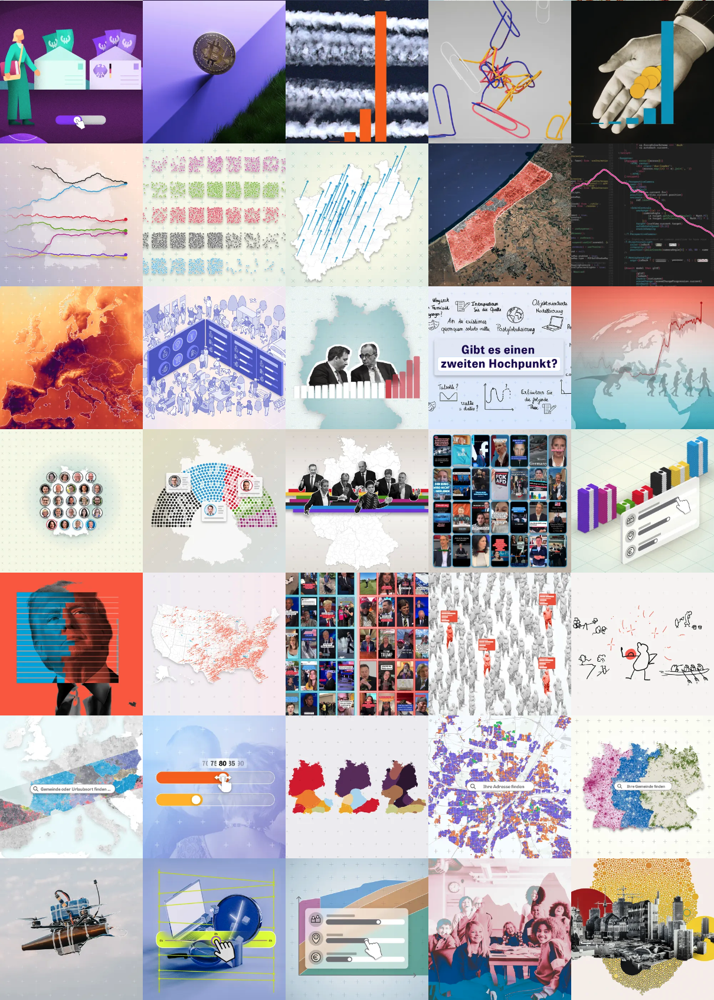
</div>
`Source` [ZEIT, Daten und Visualisierung](https://www.zeit.de/daten-und-visualisierung)
]


---
# Two routes into a data story

.pull-left[

## Route 1: Data first

You stumble upon a dataset that is genuinely curious — unexpected patterns, suspiciously clean numbers, a leaked dataset of AI-generated content that shows systematic bias against certain topics.

*The dataset is the tip. Follow it.*

<br>

### The journalist's instinct

Not every dataset is a story. The question is whether the data reveals something **surprising**, **consequential**, or **hidden** — ideally all three.
]

.pull-right[
## Route 2: Story first

Public discourse is already moving — migration, inflation, housing, AI surveillance. Ask: which data could tell me something useful about this that nobody has looked at yet?

*The question is the tip. Find data that can answer it.*

<br>

### A useful exercise

Take today's front page. For each story: what data exists? What data is *missing*? Who controls it?

]


---
class: inverse, center, middle
name: sources

# Data sources for journalism
<html><div style='float:left'></div><hr color='#EB811B' size=1px style="width:1000px; margin:auto;"/></html>


---
# 1. Open government data

.pull-left-wide[

## What it is

Data published by governments as a matter of policy or legal obligation — usually without restrictions on use.

## Some key portals 
- [data.europa.eu](https://data.europa.eu) — EU open data portal
- [data.gov](https://data.gov) — US federal data
- [govdata.de](https://www.govdata.de) — Germany
- [TED](https://ted.europa.eu), [USASpending.gov](https://usaspending.gov), [Eurostat](https://ec.europa.eu/eurostat/), [OECD.Stat](https://data-explorer.oecd.org/), [World Bank Open Data](https://data.worldbank.org/)

## What to watch for

- Data quality varies enormously
- "Open" doesn't mean easy: PDFs, inconsistent formats, missing codebooks. But this can also increase the value of your work
- Publication lag: some datasets are months behind reality
]

.pull-right-small[
<div align="center">
<br>
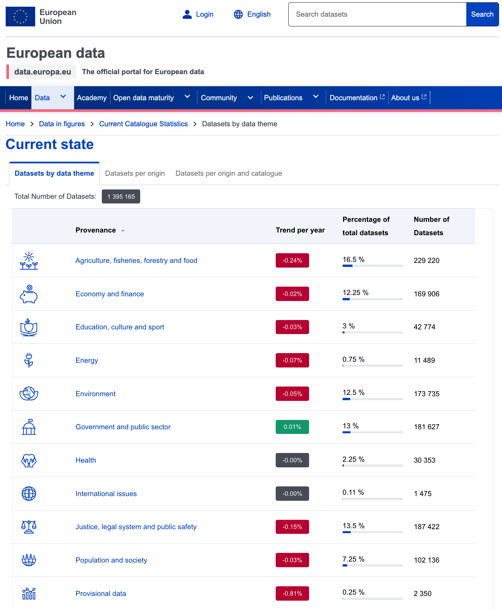
</div>
]


---
# 1. Open government data — case study

.pull-left-small2[
<div align="center">
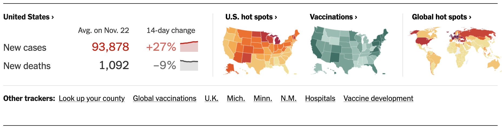
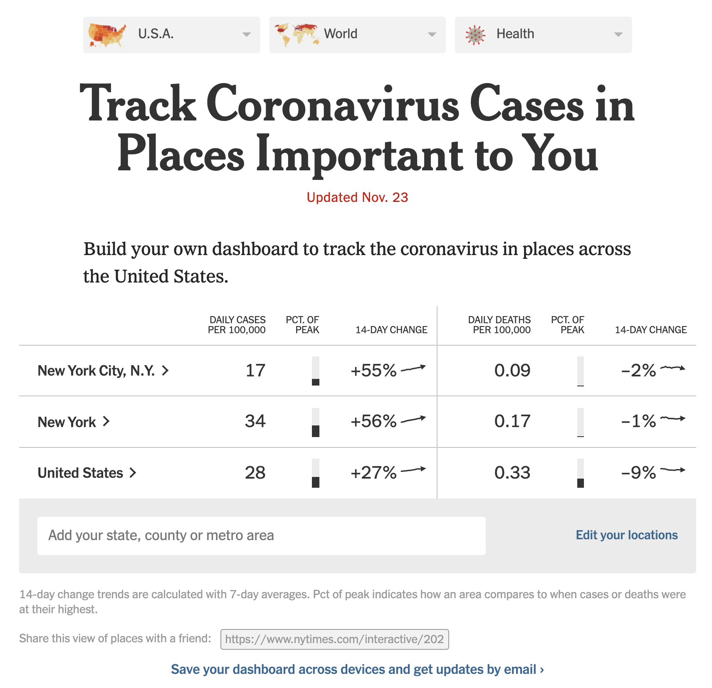

</div>
`Source` [Track Covid-19 in the U.S., NYT](https://www.nytimes.com/interactive/2023/us/covid-cases.html)
]

.pull-right-wide2[

## NYT COVID-19 tracker (2020–2023)

**What they did:** Compiled case and death counts from 50+ state health departments, thousands of county health agencies, and the CDC — because no single comprehensive source existed. Plus, they published the [full dataset on GitHub](https://github.com/nytimes/covid-19-data) — enabling hundreds of follow-on stories by other outlets.

**Why it mattered:** Documented a patchwork of reporting methods. Building on this infrastructure, the NY Attorney General's office found that New York had undercounted nursing home deaths by ~50%.

## Lessons learned

- The act of *compiling* data across fragmented sources is itself a journalistic contribution
- Publishing the dataset openly multiplied the impact: hundreds of follow-on stories by other outlets
]


---
# 2. Researcher data

.pull-left-wide2[

## What and why

Datasets compiled and maintained by academics for research purposes — often with high methodological rigor, time-series, cross-national comparability. Extra perk: researchers are usually responsive!

## Powerful examples and sources

- [Harvard Dataverse](https://dataverse.harvard.edu) — replication data for published research
- [GDELT Project](https://www.gdeltproject.org) — global event, media, and network data (massive scale)
- [Our World in Data](https://ourworldindata.org) — cleaned, documented data on global development indicators
- [Correlates of War](https://correlatesofwar.org) — conflict data since 1816
- [Manifesto Project](https://manifesto-project.wzb.eu) — party policy positions across 1000+ parties, 50+ countries
- [erikgahner/PolData](https://github.com/erikgahner/PolData) — curated list of 500+ political science datasets (elections, parties, legislators, conflict, democracy)
]

.pull-right-small2[
<div align="center">
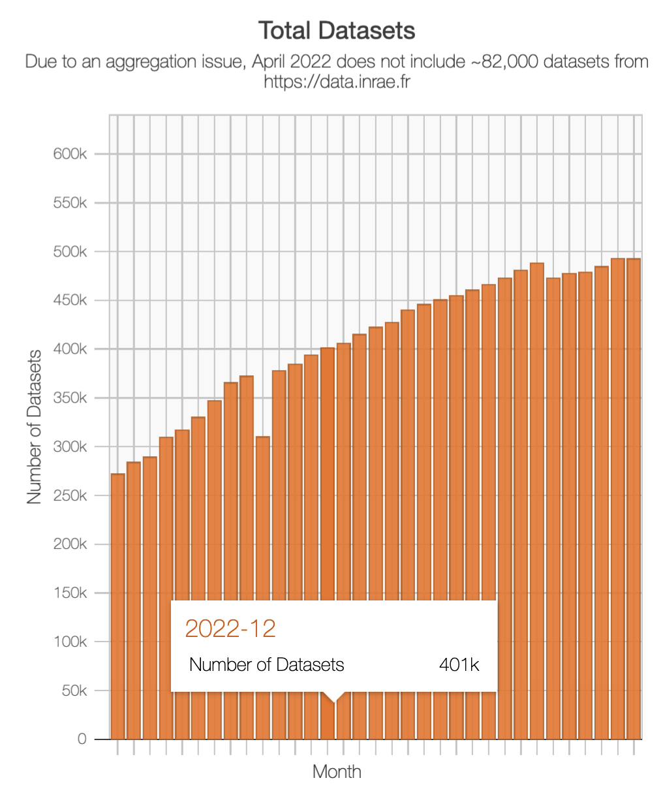<br>
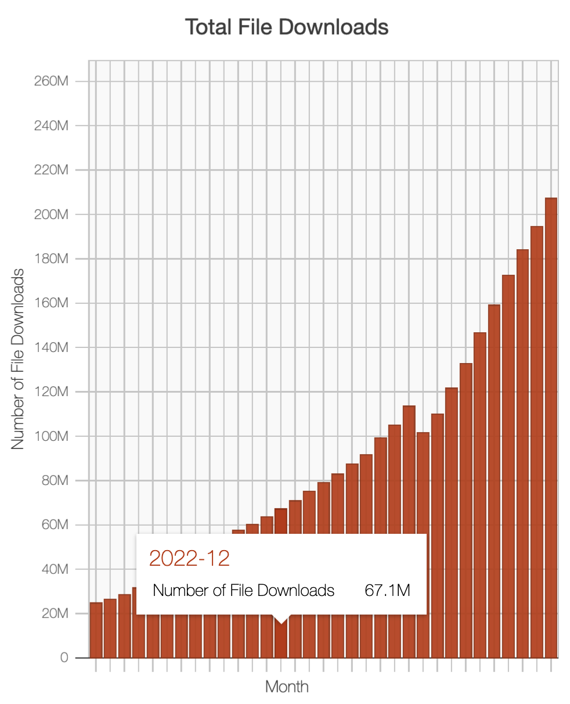
</div>
`Source` [Harvard Dataverse metrics](https://dataverse.org/metrics)
]


---
# 2. Researcher data — case study

.pull-left-small2[
<div align="center">

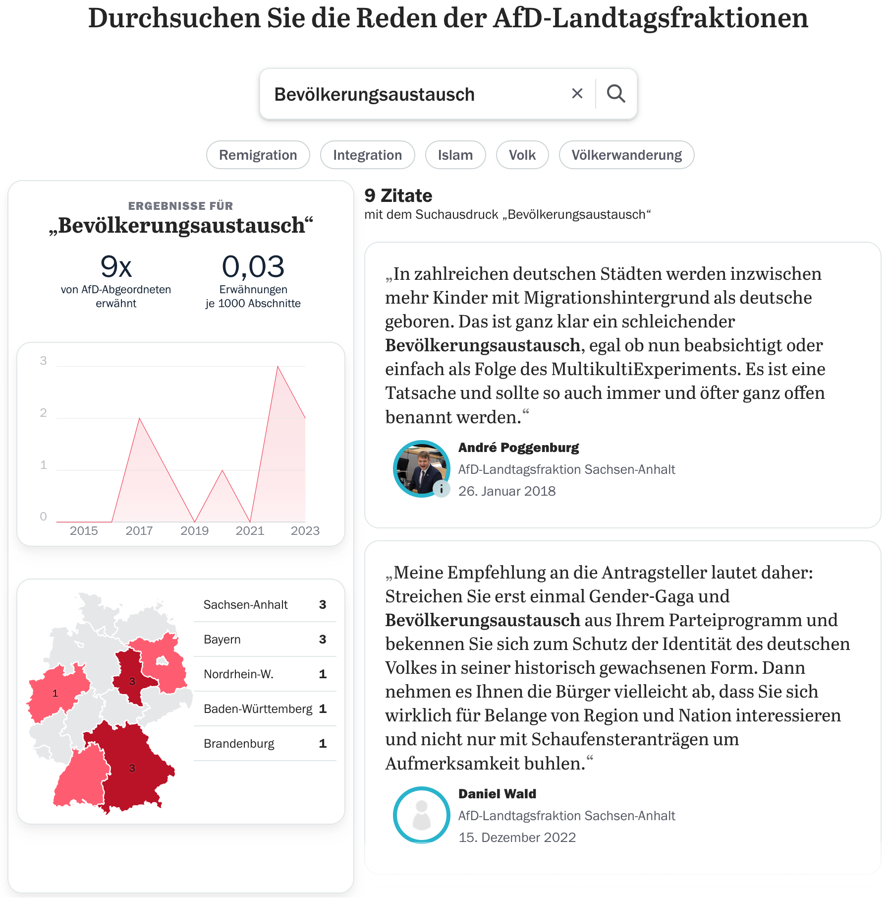
</div>
`Source` [Tagesspiegel Interaktiv](https://interaktiv.tagesspiegel.de/lab/von-messermaennern-und-ficki-ficki-bereicherern-so-trug-die-afd-den-hass-in-die-parlamente/)
]

.pull-right-wide2[

## Tagesspiegel: AfD hate speech in state parliaments

**What they did:** Analysed xenophobic speech patterns across all German state parliament debates using [StateParl](https://doi.org/10.7802/2854) — a research dataset compiled by FU Berlin that converts PDF and Word transcripts from all Landtage into structured, machine-readable text with speaker, state, and faction metadata.

**Method:** Fine-tuned a language model to classify xenophobic statements; combined with topic modelling to identify dominant narratives and select representative quotes.

**Why it's a strong case**

- Research infrastructure (StateParl) made an otherwise intractable data collection problem solvable
- Combines computational methods with qualitative validation
- Transparent methodology statement explains both the data source and some analytical choices
]


---
# 3. Survey data

.pull-left-wide2[

## What it is

Systematic measurement of attitudes, behaviors, or experiences across a sample of individuals.

## Key sources

- [Eurobarometer](https://europa.eu/eurobarometer/) — EU public opinion, twice yearly
- [European Social Survey](https://www.europeansocialsurvey.org) — cross-national, high methods standards
- [Pew Research Center](https://www.pewresearch.org/download-datasets/) — global attitudes, US politics, religion, tech
- [ANES](https://electionstudies.org) — American National Election Studies (since 1948)
- [World Values Survey](https://www.worldvaluessurvey.org) — values and beliefs across 90+ countries
- [GESIS](https://www.gesis.org) — German social science data archive, huge catalogue

## Cautions (more next week!)

- Sampling matters: online opt-in panels ≠ probability samples
- Good description is valuable but requires high quality data

]

.pull-right-small2[
<div align="center">
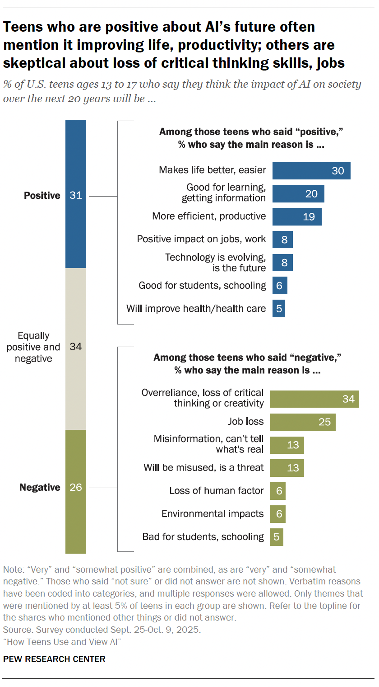
</div>
`Source` [Pew Research Center, 2026](https://www.pewresearch.org/internet/2026/02/24/how-teens-use-and-view-ai/)
]


---
# 4. Online APIs and algorithmic systems

.pull-left-wide2[

## What it is

Application Programming Interfaces allow programmatic access to data or services. In the age of AI and platform monopolies, APIs are also **windows into automated systems** that make consequential decisions.

## Algorithmic/platform APIs worth auditing

- [OpenAI moderation endpoint](https://developers.openai.com/api/docs/guides/moderation/) — content classification
- Platform APIs (Reddit, YouTube Data API) — public content and engagement signals
- Ad targeting APIs (Meta, Google) — who gets shown what

## The audit opportunity

Algorithmic systems are often opaque. But if they expose an API, you can probe them systematically — varying inputs by race, gender, language, topic — and measure disparate outputs.

]

.pull-right-small2[
<div align="center">
<br>
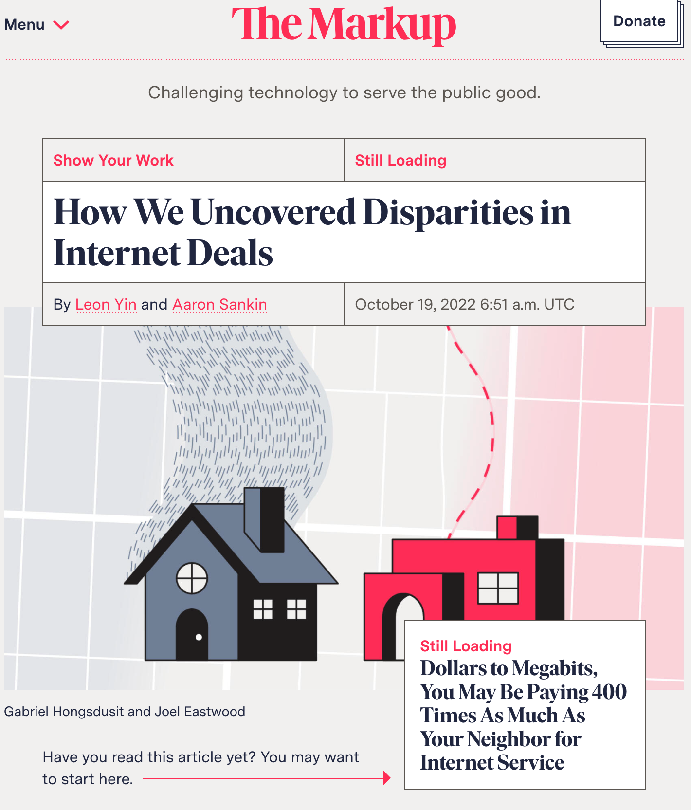
</div>

`Source` [The Markup](https://themarkup.org/show-your-work/2022/10/19/how-we-uncovered-disparities-in-internet-deals)
]


---
# 5. Web data

.pull-left-wide2[

## What it is

Any data extracted from publicly accessible websites — through scraping (HTML), intercepting undocumented APIs (Network tab), or automated browser interaction (browser automation).

## Three modes of access
1. **Static HTML scraping** — `rvest`, `BeautifulSoup`; works when content is server-rendered
2. **Undocumented APIs** — inspect browser Network tab; replicate with `httr2`
3. **Browser automation** — `selenider`, Playwright; for JavaScript-rendered content requiring interaction

## What's out there

Company filings, court records, property registries, job postings, social media, price data, entertainment, political advertising, ...
]

.pull-right-small2[
<div align="center">
<br>
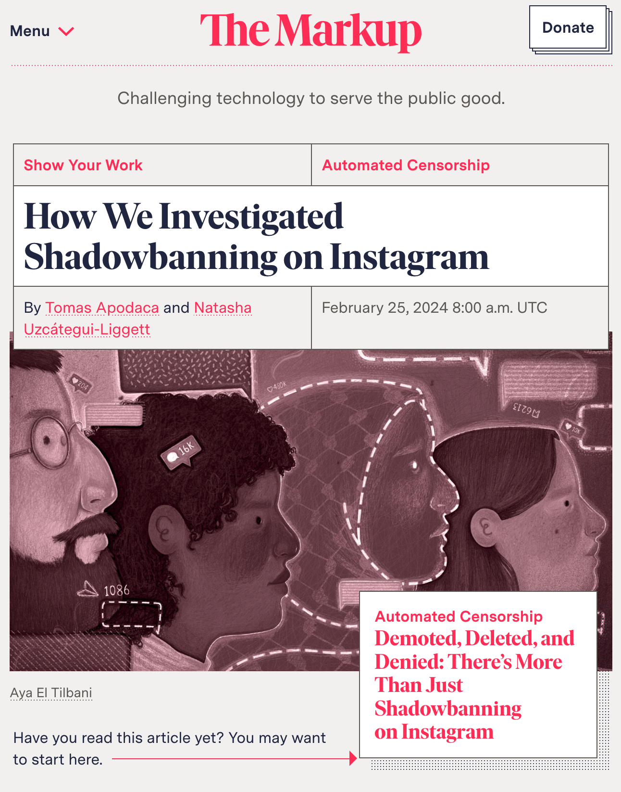
</div>
`Source` [The Markup](https://themarkup.org/automated-censorship/2024/02/25/how-we-investigated-shadowbanning-on-instagram)
]


---
# 6. Investigative and FOIA data

.pull-left-wide2[

## What it is

Data obtained through formal legal mechanisms (freedom of information requests), leaks, or through journalistic fieldwork.

## FOI mechanisms and resources

- Germany: Informationsfreiheitsgesetz (IFG) — federal; 
- EU: [Regulation 1049/2001](https://eur-lex.europa.eu/legal-content/EN/TXT/?uri=CELEX:32001R1049) — access to EU institutions
- US: [FOIA](https://www.foia.gov/) — federal; state equivalents vary
- [MuckRock](https://www.muckrock.com) — collaborative FOIA filing and publishing platform
- [AskTheEU.org](https://www.asktheeu.org) — EU equivalent
- [FragDenStaat](https://fragdenstaat.de) — German equivalent

## Why it matters

Some of the most important data in existence is held by governments and not proactively published. FOI turns the *absence* of data into a story — through what is withheld, redacted, or delayed.
]

.pull-right-small2[
<div align="center">
<br>
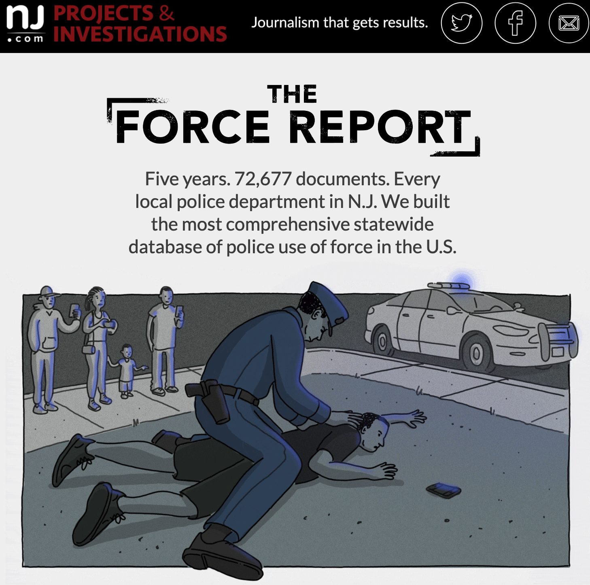
</div>
`Source` [NJ.com, Force Investigation Report](https://force.nj.com/)
]


---
class: inverse, center, middle
name: resources

# Resources
<html><div style='float:left'></div><hr color='#EB811B' size=1px style="width:1000px; margin:auto;"/></html>


---
# Where to start

.pull-left[

## Finding and working with data

- [erikgahner/PolData](https://github.com/erikgahner/PolData) — 500+ political science datasets, well-maintained
- [Awesome Public Datasets](https://github.com/awesomedata/awesome-public-datasets) — broad catalogue across domains
- [Google Dataset Search](https://datasetsearch.research.google.com) - search engine for datasets across the web
- [Our World in Data](https://ourworldindata.org) — cleaned long-run data with source documentation
- [Hugging Face Datasets](https://huggingface.co/datasets) — ML-oriented but contains many useful corpora

## APIs

- [Public APIs](https://github.com/public-apis/public-apis) — curated list of free APIs
- [RapidAPI Hub](https://rapidapi.com/hub) — API discovery platform

]

.pull-right[

## Investigative data journalism

- [GIJN Data Journalism Guide](https://gijn.org/data-journalism/) — global investigative journalism network
- [The Markup](https://themarkup.org) — algorithmic accountability journalism; read for both stories and methodology notes
- [Bellingcat Online Investigation Toolkit](https://bellingcat.gitbook.io/toolkit) — OSINT methods

## Community and practice

- [NICAR-L](https://www.ire.org/resources/listservs/) — data journalism listserv; decades of practical advice
- [Datajournalism.com](https://datajournalism.com) — handbook and case studies
- [OpenNews Source](https://source.opennews.org) — practitioner-written how-tos
]
