```{css, echo=FALSE}
@media print {
  .has-continuation {
    display: block !important;
  }
}
```

```{r setup, include=FALSE}
options(htmltools.dir.version = FALSE)
library(knitr)
opts_chunk$set(
  prompt = T, fig.align = "center",
  dpi = 300, cache = T,
  engine.opts = list(bash = "-l")
)
knit_hooks$set(
  prompt = function(before, options, envir) {
    options(
      prompt = if (options$engine %in% c('sh', 'bash')) '$ ' else 'R> ',
      continue = if (options$engine %in% c('sh', 'bash')) '$ ' else '+ '
    )
  })
library(tidyverse)
library(fontawesome)
```


# Today

</br></br>

1. [Surveys in the wild](#wild)

2. [How surveys are made](#made)

3. [Survey sampling 101](#sampling)

4. [Take-aways](#resources)


---
class: inverse, center, middle
name: wild

# Surveys in the wild
<html><div style='float:left'></div><hr color='#EB811B' size=1px style="width:1000px; margin:auto;"/></html>


---
# Why should data journalists care about surveys?

.pull-left-wide2[
Surveys are everywhere in the news: election polls, consumer confidence, trust in institutions, vaccination rates, public opinion on any policy issue imaginable. 

As a data journalist, you will rarely design your own survey — but you will **consume, evaluate, and report on** surveys almost daily.

## Key questions

- How was this survey conducted?
- Who was sampled and how?
- Does the survey design (not just sample size) justify the claims?
- What was the exact question wording?
- What is the (real) margin of error?
]

.pull-right-small2[
<div align="center">
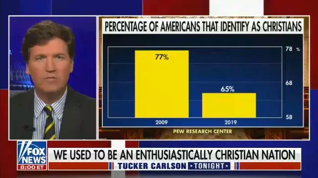
<br><br>

</div>
]


---
class: exercise

# Exercise: How would you report this?

.pull-left[

## Scenario A

A press release from a political consulting firm says:

> "72% of Germans support a ban on combustion engine cars by 2035."

The survey was conducted online; n = 1,200

<br>

## Discuss (3 min)

- What questions would you ask before reporting this number?
- What information is missing?
]

--

.pull-right[

## Scenario B

A new study in *The Lancet* reports:

> "Vaccine hesitancy increased by 12 percentage points in 6 months, based on a sample of 250,000 respondents recruited via Facebook Ads."

<br><br>

## Discuss (3 min)

- What do you think about the sample size?
- How would you report the uncertainty around the "12 percentage points"?
]


<!--

<div align="center">

</div>

"One in three young men endorses violence against women — 34 percent of heterosexual men aged 18 to 35 say in a survey that they have 'gotten physical' in a relationship — to 'instill respect' in their female partners."

`Source` [Anika Freier, SPIEGEL](https://www.spiegel.de/partnerschaft/gewalt-gegen-frauen-jeder-dritte-junge-mann-wird-gegenueber-frauen-handgreiflich-um-ihnen-respekt-einzufloessen-a-67e93469-0d0c-4d3c-994d-422e85679a99)

`Link to original study` [Plan International](https://www.plan.de/fileadmin/website/04._Aktuelles/Umfragen_und_Berichte/Spannungsfeld_Maennlichkeit/Plan-Umfrage_Maennlichkeit-A4-2023-NEU-online_2.pdf)
-->

---
# International guidelines for reporting on polls

.pull-left[

## AAPOR (USA)

The **Journalist Cheat Sheet** ([aapor.org](https://aapor.org/wp-content/uploads/2024/03/Journalist-Cheat-Sheet-Guide-to-Polling-FINAL.pdf)) distills the essentials: Who paid? Probability or non-probability sample? Exact question wording? Margin of error? What do other polls say? Interesting rule: **"Error margin should not be reported for non-probability samples."**


## ESOMAR/WAPOR

The **Guideline on Opinion Polls and Published Surveys** ([esomar.org](https://wapor.org/wp-content/uploads/esomar-wapor-guideline-on-opinion-polls-and-published-surveys-english-august-2014.pdf)) is the international reference. Their 2023 Freedom Report found that experts rate the quality of journalistic poll reporting as low in more than half of surveyed countries.
]

.pull-right[
## Pew Research Center

**Tips for Journalists Covering Polls** (2024; [pewresearch.org](https://www.pewresearch.org/decoded/2024/09/11/pew-research-centers-tips-for-journalists-covering-polls-during-election-season-and-beyond/)), originally published in the IRE Journal. Common mistakes: treating MoE as total error; reporting decimal places; calling 51% a "majority" when MoE is ±3. **Check the link for a collection of very useful advice.**

<div align="center">
<br>

</div>
]


---
# German guidelines (for those who are interested)

.pull-left[

## Germany

**Pressekodex, Richtlinie 2.1** ([presserat.de](https://www.presserat.de/pressekodex.html)): When publishing poll results, the press must report the number of respondents; the timing of fieldwork; the exact question wording; the commissioning party; and whether results are representative. Non-representative online polls must be labeled as such (Presserat ruling, March 2018).

**Richtlinie für die Veröffentlichung von Ergebnissen der Markt- und Sozialforschung** (2024/2025; [rat-marktforschung.de](https://www.rat-marktforschung.de/)): Binding industry code by ADM, ASI, BVM, DGOF. Requires institute name, client, population, sample size, fieldwork dates, mode, weighting, and question wording for every published study. Applies via *Verkehrssitte* even to non-members.
]

.pull-right[
## A test case: Civey vs. Presserat

In 2018, Forsa, Infas, and Forschungsgruppe Wahlen complained to the Presserat that Focus Online had published a Civey poll as "representative" without adequate scrutiny.

The Presserat found **no violation** — the editors had no reason to doubt their partner's claims. The ruling was widely criticized: the Presserat effectively declined to assess methodological quality.

Richtlinie 2.1 sets a transparency floor, but it does not require — or enable — the Presserat to evaluate whether a survey's *methods* justify its claims.

`Article` [Stefan Fries, Deutschlandfunk](https://stefan-fries.com/2018/12/04/presserat-sieht-in-verwendung-von-civey-umfragen-keinen-verstoss-gegen-den-pressekodex/)
]


---
class: inverse, center, middle
name: made

# How surveys are made
<html><div style='float:left'></div><hr color='#EB811B' size=1px style="width:1000px; margin:auto;"/></html>


---
background-image: url(pics/surveys-sausages.gif)
background-size: contain
background-position: center
background-color: #000000

# A wisdom to start with


---
# The survey production pipeline

.pull-left-wide[

## From question to data

<br>

1. **Define the research question** — what do you want to learn?

2. **Design the questionnaire** — question wording, order, response scales

3. **Select the survey mode** — phone, online, face-to-face, mail

4. **Draw the sample** — from a sampling frame (register, panel, phone book)

5. **Fieldwork** — actually collect responses

6. **Data processing** — cleaning, coding, weighting

7. **Analysis and reporting** — estimates, margins of error, tables
]

.pull-right-small[
## Total Survey Error framework

<div align="center">
<br>
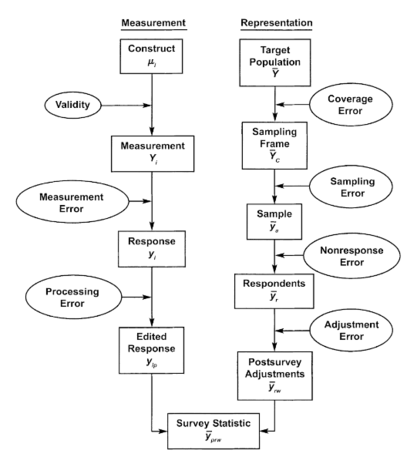
</div>

`Source` [Groves et al. 2009, Survey Methodology](https://books.google.de/books?hl=de&lr=&id=HXoSpXvo3s4C)
]


---
# The art of asking questions

.pull-left[
## Common pitfalls in questionnaire design

**Leading questions**: "Don't you agree that climate change is the most pressing issue?" → pushes respondents toward agreement.

**Double-barreled questions**: "Do you support increasing taxes and spending on education?" → conflates two separate opinions.

**Acquiescence bias**: respondents tend to agree with statements, regardless of content. Mitigated by mixing positively and negatively worded items.

**Social desirability**: respondents underreport socially stigmatized behavior (e.g., drug use, racist attitudes) and overreport socially approved behavior (voting, donating, exercising).
]

.pull-right[
## Classic question order experiment

"Do you think [the United States | a Communist country like Russia] should let [Communist | American] newspaper reporters from other countries come in here and send back to their papers the news as they see it?

<div align="center">
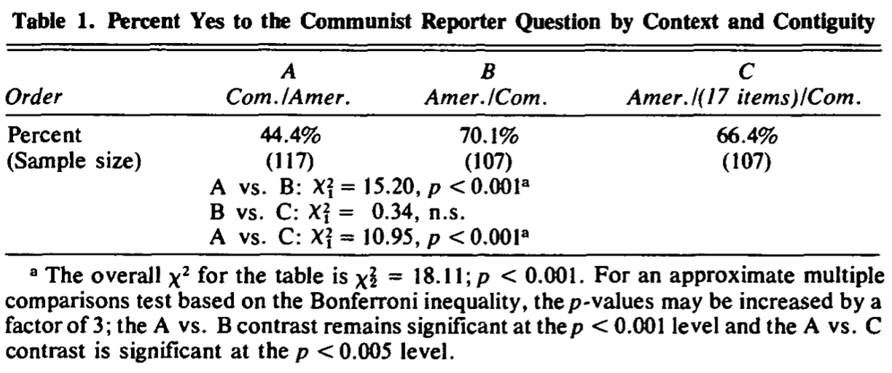
</div>

`Source` [Schuman, Kalton and Ludwig 1983](https://www.jstor.org/stable/2748710)
]


---
# Measurement quality: a journalist's toolkit

.pull-left[
## What to watch for in question wording

**Check for framing effects**: was the question preceded by a vignette or preamble that could prime respondents? ("Given the recent terrorist attacks, do you support...")

**Check for asymmetric scales**: "Strongly agree / Agree / Neutral / Disagree" — where is "Strongly disagree"? Unbalanced scales push responses toward one side.

**Check for order effects**: questions earlier in the survey can prime answers to later questions. If question 5 asks about crime, question 6 about immigration may get different answers than if the order were reversed.

**Check for filter questions**: did the survey screen out certain respondents before the key question? "Among those who said they are likely to vote..." — this subgroup may not resemble the full population.
]

.pull-right[
## Another question order experiment 

<div align="center">
<br>
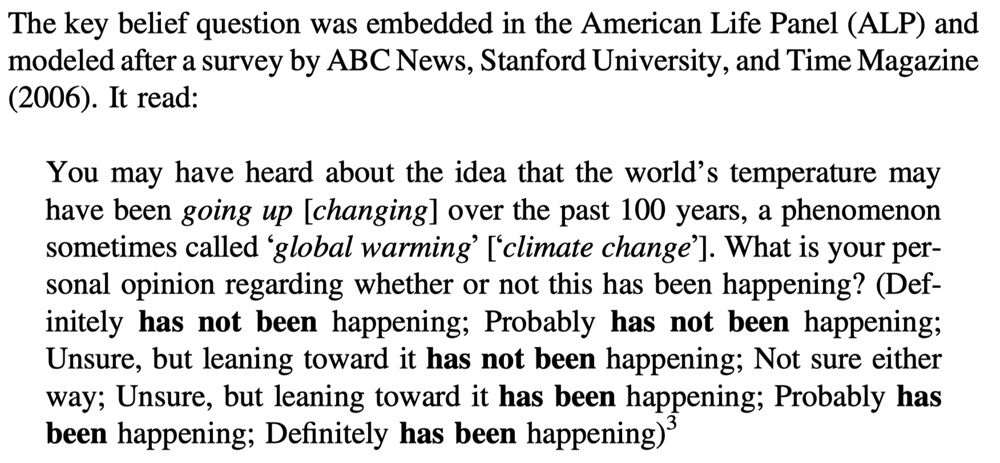
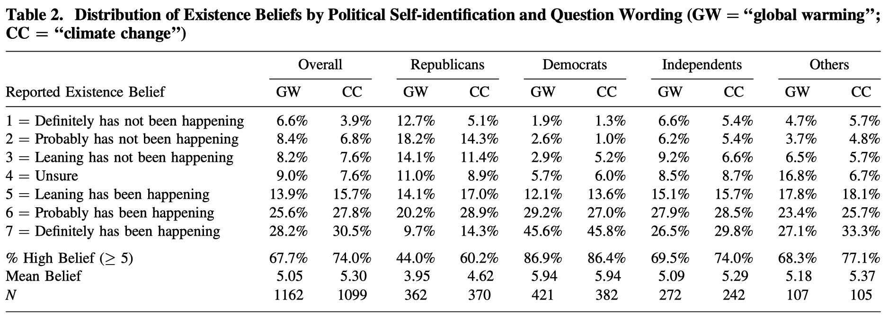
</div>

`Source` [Schuldt et al., POQ](https://www.jstor.org/stable/41288371)
]


---
# Survey modes: then and now

.pull-left[
## As phone response rates go down...

<div align="center">
<br>
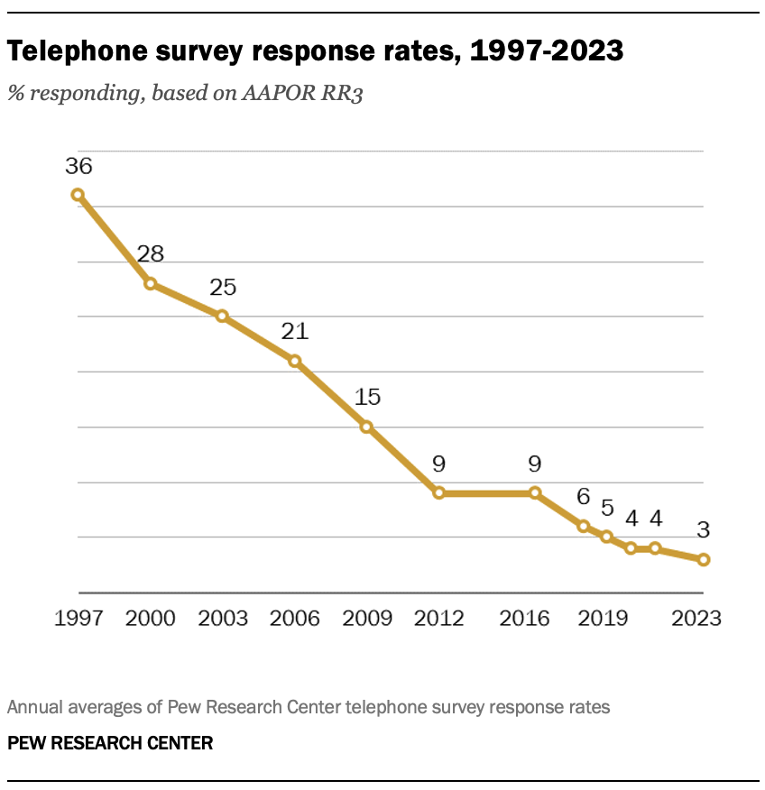
</div>
]

.pull-right[
## ...pollsters turn to online panels

<div align="center">
<br>
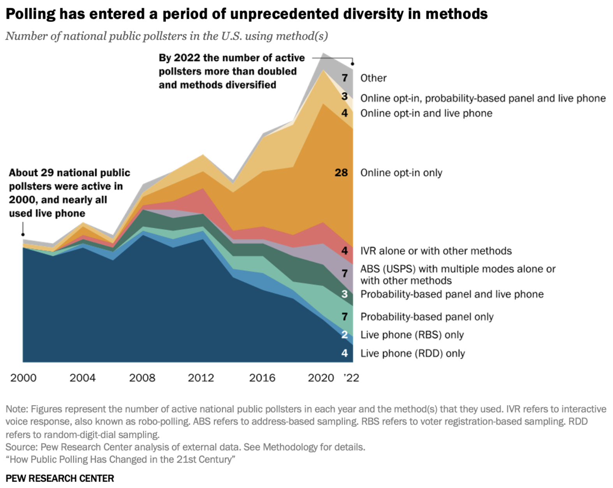
</div>
]

`Source` [Pew Research](https://www.pewresearch.org/course/public-opinion-polling-basics/)


---
# Survey modes: how data is collected

.pull-left[
## Traditional modes

**CATI** (Computer-Assisted Telephone Interview): random-digit dialing or registry-based. Still used by major pollsters (Infratest dimap, Forsa). Declining response rates are a serious problem — down to ~1–10% in many countries.

**CAPI** (Computer-Assisted Personal Interview): face-to-face, household-based. Gold standard for large social surveys (ESS, SOEP, ALLBUS). Expensive; used for long, complex questionnaires.

**Mail / paper**: still used for census and some government surveys. Slow but reaches populations without internet/phone.
]

.pull-right[
## Online modes

**Access panels**: pre-recruited pools of respondents who agreed to take surveys in exchange for incentives. Major providers: YouGov, Bilendi/Respondi, Dynata.

**Crowdsourcing platforms**: MTurk, Prolific, CloudResearch. Popular in academia; convenience samples with known demographic skews (younger, more educated, more liberal).

**Self-selected / opt-in**: anyone who feels like participating clicks a link. **Not a survey** in any rigorous sense — but often reported as one.
]


---
# Access panels and the economics of survey production

.pull-left-small2[
## How access panels work

1. A panel company (e.g., YouGov, Bilendi) **recruits** hundreds of thousands of people who agree to take surveys regularly.
2. For each new survey, a **sample is drawn from the panel** — either randomly or quota-based (e.g., targets for age × gender × region). 🚨 Even if drawn randomly from the panel, this is *not* a random sample of the population!
3. Panelists receive an **invitation** (email, app notification) and an **incentive** (points, vouchers, small payments).
4. The raw data is **weighted** to match known population benchmarks (from census or microcensus data).
]

.pull-right-wide2[
## Speed vs. quality trade-off

- A phone poll of n = 1,000 typically takes **3–5 days** of fieldwork.
- An online panel survey of n = 2,000 can be fielded in **24–48 hours**.
- Speed matters for tracking fast-moving opinion (elections, crises) but can sacrifice quality.

## Cost per completed interview (approximate)

<div style="margin-bottom:40px;"></div>

| Mode | CPI|
|---|---|
| Face-to-face (CAPI) | €50–150 |
| Phone (CATI) | €15–40 |
| Online panel | €1–10 |
| Opt-in / self-selected | ~€0 |
]


---
# Pew study (2023) on probability vs. opt-in samples

.pull-left[
## The study

- 6 parallel online surveys of ~5,000 U.S. adults each, benchmarked against 28 government data sources
- Opt-in samples had twice the error of probability panels (5.8 vs. 2.6 pp average absolute error)
- Opt-in errors worst for hard-to-reach groups: 11.2 pp for 18–29-year-olds, 10.8 pp for Hispanic adults — largely driven by ~8–15% "bogus respondents" who say Yes to everything

<div align="center">
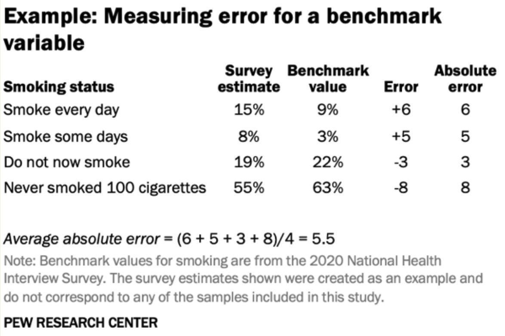
</div>
]

.pull-right[
<div align="center">
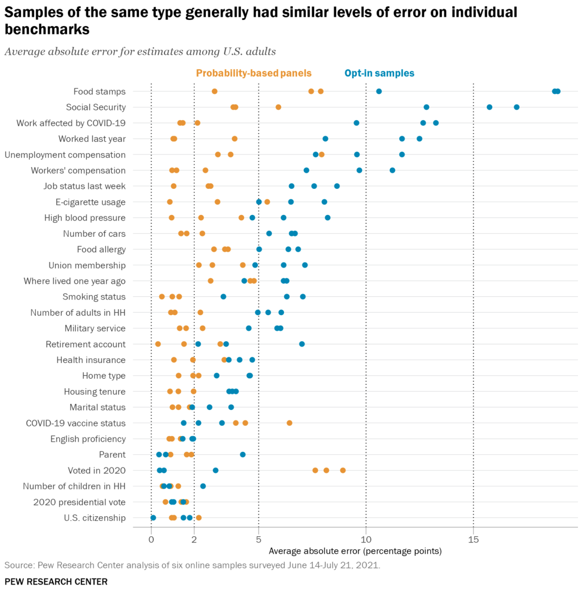
</div>

`Source` [Pew Research (link to full report)](https://www.pewresearch.org/methods/2023/09/07/comparing-two-types-of-online-survey-samples/)
]


---
class: inverse, center, middle
name: sampling

# Survey sampling 101
<html><div style='float:left'></div><hr color='#EB811B' size=1px style="width:1000px; margin:auto;"/></html>


---
class: exercise
background-image: url(pics/reprasentative-umfragen.png)
background-size: contain
background-position: center

# Question: How would you define "representative survey"?


---
# Representativity is in the eye of the beholder

.pull-left[
## A folk definition of representativity

A sample (or data in general) is "representative" if **conclusions drawn from the sample can be generalized** to the population of interest.

## Why "representativity" is a problematic term

1. Whether a sample is representative **depends on your interest**. A sample can be representative for age and gender but not for income.
2. You cannot call a sample "representative" **a priori** — only after checking.
3. Assessing representativity requires **external benchmarks** (census, register data) — and those have their own limitations.
]

.pull-right[
<div align="center">
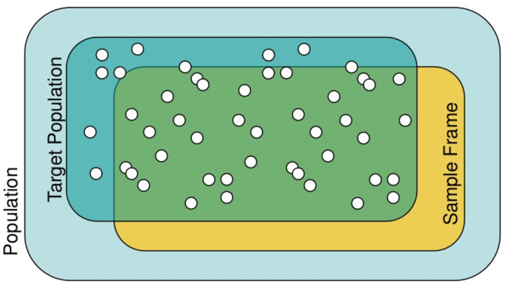
</div>

## What this means for journalists

- Don't take reported "representativity" at face value.
- Sample size alone does not guarantee representativity.
- State specifically what the sample is supposed to be representative of (e.g., "representative of German adults aged 18+") and provide additional details on methods.
- Bad sampling is not restricted to surveys — think social media data, case selection for medical trials, or country selection for policy studies.
]


---
# Why sampling (generally) works

.pull-left[
## The fundamental idea

If you draw a **random sample** from a population, the sample statistics (mean, proportion, etc.) will be close to the population parameters — and you can **quantify how close**.

This is the core insight of survey statistics and it rests on the **law of large numbers** and the **central limit theorem**.

## Notation

- $N$ = population size
- $n$ = sample size
- $p$ = true population proportion
- $\hat{p}$ = sample proportion
- $\text{SE}(\hat{p})$ = standard error of $\hat{p}$
]

.pull-right[
## The sampling distribution

If you drew many random samples of size $n$ from a population and computed $\hat{p}$ each time, those estimates would form a **normal distribution** centered on $p$ with standard deviation:

$$\text{SE}(\hat{p}) = \sqrt{\frac{p(1-p)}{n}}$$

This gives us the **margin of error** at 95% confidence:

$$\text{MoE} = 1.96 \times \text{SE}(\hat{p})$$

## Example

If $\hat{p} = 0.45$ and $n = 1{,}000$: $\text{MoE} = 1.96 \times\sqrt{\frac{0.45 \times 0.55}{1000}}  \approx 0.031$


So we could report: **45% ± 3.1 percentage points**.
]


---
# How important is sample size?

.pull-left[
## The square root law

The margin of error shrinks with the **square root** of $n$:

$$\text{MoE} \propto \frac{1}{\sqrt{n}}$$

This has a sobering implication: **doubling accuracy requires quadrupling the sample size.**

<table style="font-size:70%; width:100%;">
<thead>
<tr><th><i>n</i></th><th>MoE (<i>p</i> = 0.5)</th><th>MoE (<i>p</i> = 0.25)</th><th>MoE (<i>p</i> = 0.1)</th></tr>
</thead>
<tbody>
<tr><td>100</td><td>±9.8%</td><td>±8.5%</td><td>±5.9%</td></tr>
<tr><td>400</td><td>±4.9%</td><td>±4.2%</td><td>±2.9%</td></tr>
<tr><td>1,000</td><td>±3.1%</td><td>±2.7%</td><td>±1.9%</td></tr>
<tr><td>2,000</td><td>±2.2%</td><td>±1.9%</td><td>±1.3%</td></tr>
<tr><td>10,000</td><td>±1.0%</td><td>±0.8%</td><td>±0.6%</td></tr>
</tbody>
</table>

Most national polls use n = 1,000–2,000 because the gains beyond that are marginal relative to cost.
]

.pull-right[
## What sample size does NOT fix

Sample size controls **random error** (variance). It does **nothing** for **systematic error** (bias).

A biased sample of n = 1,000,000 is worse than an unbiased sample of n = 1,000.

> "The 'bigness' of such Big Data (for population inferences) should be measured by the relative size $f = n/N$ of the sample to the population, not by the absolute size $n$ of the sample."

<div align="right">Xiao-Li Meng (2018), <i>Annals of Applied Statistics</i></div>

👉 Stay tuned for the "Big Data Paradox" and the **R workshop script** `code/surveys/working-with-surveys.qmd` for a hands-on simulation.
]


---
# Simple random sampling (SRS)

.pull-left[
## Definition

Every member of the population has an **equal probability** of being selected: $\pi_i = n/N$ for all $i$.

## How it works in practice

1. Obtain a **sampling frame** — a list of all units in the population (e.g., voter registry, address register).
2. Assign each unit a random number.
3. Select the $n$ units with smallest random numbers.

## Variance of the sample mean under SRS

$$\text{Var}(\bar{y}_{SRS}) = \frac{S^2}{n} \left(1 - \frac{n}{N}\right)$$

where $S^2 = \frac{1}{N-1}\sum_{i=1}^{N}(y_i - \bar{Y})^2$ and the term $(1 - n/N)$ is the **finite population correction** (FPC).
]

.pull-right[
## Limitations

- Requires a complete sampling frame
- Can still yield unbalanced samples by chance
- Inefficient for rare subpopulations
- Sampling frame $\neq$ realized sample

## The sampling frame problem

In practice, **no perfect sampling frame exists** for most populations. Phone registries miss mobile-only households. Address registers miss the homeless, recent migrants, and institutional populations.

## Key insight

When a poll says "random sample," ask: **random from what list?** The frame determines who *can* be reached, not who ended up in the survey.
]


---
# Stratified sampling

.pull-left[
## Definition

Divide the population into non-overlapping **strata** (e.g., by age group, region, education) and draw an independent random sample within each stratum.

## Why stratify?

1. **Guarantees representation** of key subgroups.
2. **Reduces variance** — if strata are internally homogeneous, within-stratum variance is smaller than overall variance.
3. **Enables reliable subgroup estimates** — you can oversample small but important groups.

One can also oversample small/important strata (e.g., East German states). Requires **weighting** to produce unbiased population estimates.
]

.pull-right[
## Variance reduction

For a stratified sample with proportional allocation, the variance of the estimated mean is:

$$\text{Var}(\bar{y}_{st}) = \sum_{h=1}^{H} W_h^2 \frac{S_h^2}{n_h}$$

where $W_h = N_h/N$ is the stratum weight and $S_h^2$ is the within-stratum variance.

If strata are well-chosen (homogeneous within, heterogeneous between), this is **always ≤** the variance under SRS.

## Optimal (Neyman) allocation

Allocate more interviews to strata with higher variance:

$$n_h \propto N_h \cdot S_h$$
]


---
# Cluster sampling

.pull-left[
## Definition

Divide the population into **clusters** (e.g., schools, districts), randomly select a subset of clusters, then survey all (or a sample of) units within selected clusters.

## Why cluster?

- Only list of clusters not individuals needed
- **Cost-efficient** for F2F surveys: interviewers only visit selected areas
- Standard design for large household surveys

## The cost: Design effect

Cluster sampling is **less efficient** than SRS or stratified sampling. Units within a cluster tend to be similar (e.g., students in the same school), so each additional unit within a cluster adds less new information.
]

.pull-right[
## Design effect example

DEFF quantifies the efficiency loss from clustering:

$$\text{DEFF} = 1 + (m - 1) \times \rho$$

where $m$ is the average cluster size and $\rho$ is the **intra-cluster correlation** (ICC) — the degree to which units within a cluster resemble each other. The **effective sample size** is:

$$n_{\text{eff}} = n / \text{DEFF}$$

## Example

If $m = 20$ (20 students per school) and $\rho = 0.05$:

$$\text{DEFF} = 1 + 19 \times 0.05 = 1.95$$
So a cluster sample of $n = 2{,}000$ has the precision of an SRS of only $n \approx 1{,}026$.
]


---
# Multi-stage sampling: what real surveys look like

.pull-left[
## Combining strategies

Most real-world surveys use **multi-stage** designs that combine stratification and clustering:

**Stage 1**: Stratify by region (e.g., 16 Bundesländer) and urbanization (urban/rural).

**Stage 2**: Within each stratum, randomly select **clusters** (e.g., municipalities or sampling points).

**Stage 3**: Within selected clusters, randomly select **households** (from address registers).

**Stage 4**: Within selected households, randomly select **one person** (e.g., using the Kish grid or last-birthday method).

This is how the ALLBUS, ESS, SOEP, and most major social surveys work.
]

.pull-right[
## Why this matters for analysis

Standard formulas (assuming SRS) **underestimate standard errors**. Analysts must account for:

- **Stratification** (reduces SE)
- **Clustering** (increases SE)
- **Unequal selection probabilities** (requires weighting)

The R `survey` package handles all of this — you specify the design, and it computes correct standard errors.

```r
library(survey)
des <- svydesign(
  ids = ~cluster_id,    # clustering
  strata = ~stratum,    # stratification
  weights = ~weight,    # design weights
  data = my_data
)
svymean(~outcome, des)  # correct SE
```
]


---
# Weighting: fixing what sampling broke

.pull-left[
## Why weight?

Even with probability sampling, the realized sample rarely matches the population perfectly. Weighting adjusts for:

1. **Unequal selection probabilities** — if you oversampled East Germany, downweight East Germans.
2. **Nonresponse** — if young men are underrepresented, upweight those who did respond.

## How it works

Each respondent $i$ receives a weight $w_i$.

$$\hat{p}_w = \frac{\sum_i w_i \cdot y_i}{\sum_i w_i}$$
where $y_i = 1$ if resp. $i$ has the attribute of interest.
]

.pull-right[
## Common weighting approaches

**Post-stratification**: partition the sample into cross-classified cells (e.g., age × gender × region) and adjust weights so each cell matches its known population share from census data.

**Raking / iterative proportional fitting**: iteratively adjust weights to match multiple marginal distributions simultaneously — useful when the full cross-classification is unavailable or has too many empty cells.

## Limitations

Weighting cannot fix **fundamental coverage bias** — if a group is missing from the sample, no weight can recover them.

**Extreme weights** increase variance (a few respondents dominate). Good practice: trim weights at 4–5× the mean.

Weighting on the **wrong variables** can make things worse.
]


---
# Weighting in practice: an example

.pull-left[
## Scenario

You conducted an online panel survey (n = 1,000) on attitudes toward a four-day work week. Your sample is too young and too educated compared to the German population.

| Group | Census % | Sample % |
|---|---|---|
| 18–29 | 15% | 28% |
| 30–49 | 30% | 35% |
| 50–64 | 28% | 25% |
| 65+ | 27% | 12% |

## Post-stratification weights

$$w_i = \frac{\text{Census proportion for group}_i}{\text{Sample proportion for group}_i}$$

For a 65+ respondent: $w = 27/12 = 2.25$. Their response counts 2.25× as much.
]

.pull-right[
## Effect on estimates

Suppose support for the four-day work week varies by age:

| Group | Support | Unweighted share | Weighted share |
|---|---|---|---|
| 18–29 | 72% | 28% → overrepresented | 15% |
| 30–49 | 58% | 35% → slight over | 30% |
| 50–64 | 41% | 25% → slight under | 28% |
| 65+ | 25% | 12% → underrepresented | 27% |

**Unweighted estimate**: $0.28×72 + 0.35×58 + 0.25×41 + 0.12×25 = 53.7\%$

**Weighted estimate**: $0.15×72 + 0.30×58 + 0.28×41 + 0.27×25 = 46.4\%$

A 7 percentage point difference — the unweighted number was misleading because it overrepresented the pro-reform age group.
]


---
# A modern big data polling disaster

.pull-left[
<div align="center">
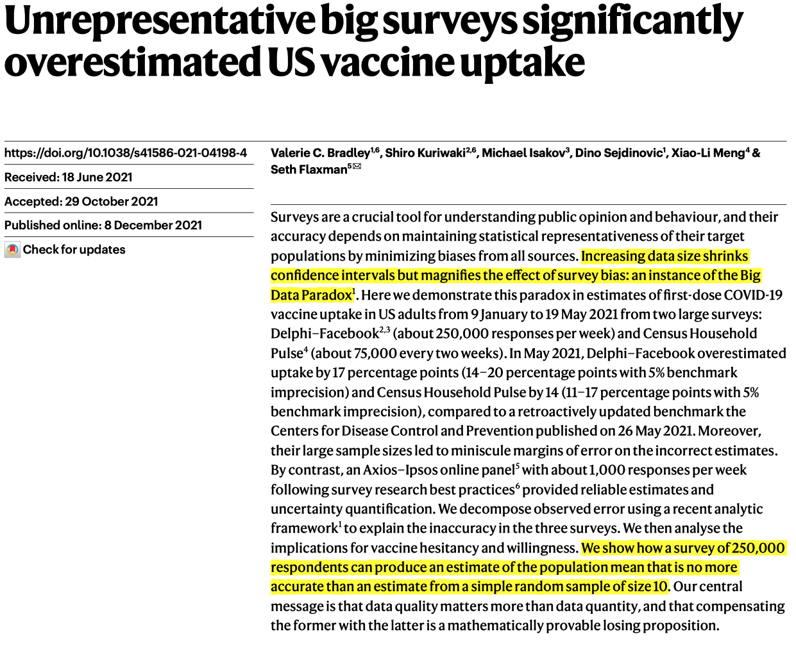
</div>
`Source` [Bradley et al. (2021), Nature](https://www.nature.com/articles/s41586-021-04198-4)
]

.pull-right[
<div align="center"><br><br>
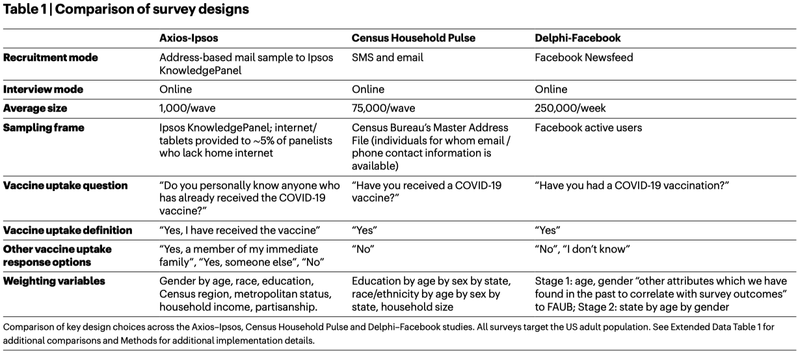
</div>
]


---
# A modern big data polling disaster

.pull-left-wide[
<div align="center"><br><br><br>
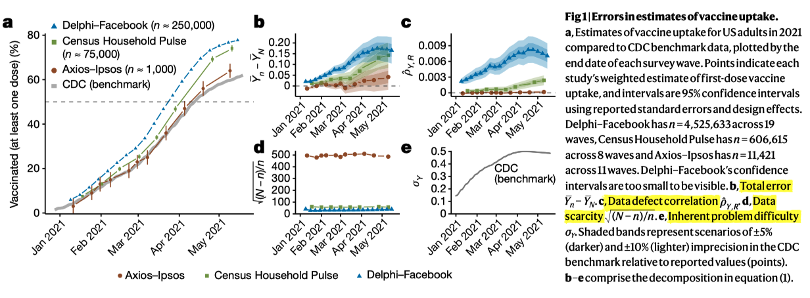
</div>

]

.pull-right-small[
<div align="center"><br><br>
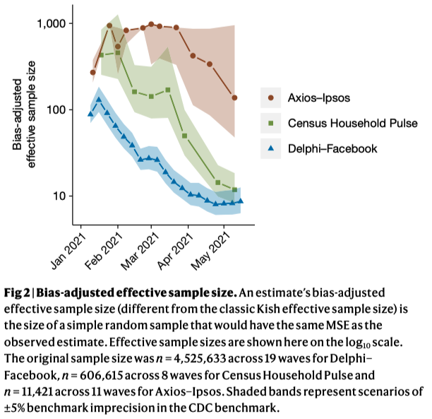
</div>
]


---
# The big data paradox: formal statement

.pull-left[
> "[W]hen biased samples are large, they are doubly misleading: they produce confidence intervals with incorrect centres and substantially underestimated widths. This is the **Big Data Paradox**: the bigger the data, the surer we fool ourselves when we fail to account for bias in data collection."

<div align="right">Bradley et al. (2021), <i>Nature</i></div>

## The key insight

The **total error** of an estimate from a non-probability sample is:

$$\text{Total error} = \underbrace{\text{Bias}}\_{\text{systematic}} + \underbrace{\text{SE}}\_{\text{random}}$$

As $n$ grows, SE shrinks — but **bias stays constant** (or can even grow if larger samples attract different types of respondents). The confidence interval narrows around the **wrong value**.
]

.pull-right[
## The Meng decomposition

[Xiao-Li Meng (2018)](https://www.jstor.org/stable/26542550) showed that the error of a non-probability estimate can be decomposed into:

$$\hat{\bar{Y}} - \bar{Y} = \rho_{R,Y} \times \sigma_Y \times \sqrt{\frac{N-n}{n}}$$

where $\rho_{R,Y}$ is the correlation between being in the sample and the outcome — the **data defect index**. 

Even tiny $\rho_{R,Y}$ (e.g., 0.005) can produce massive errors in large samples.

## What this means

- A Facebook survey with n = 250,000 and $\rho_{R,Y} = 0.004$ can have the **same total error** as an SRS of n = 10.
- The standard error formula $\sqrt{p(1-p)/n}$ dramatically underestimates uncertainty for non-probability samples.
- **Size is not a substitute for randomization.**]


---
class: exercise

# Puzzle: What's going on here? [(Selb and Munzert 2013)](https://kops.uni-konstanz.de/server/api/core/bitstreams/e755783d-acee-4592-a666-1562fc912906/content)

<div align="center">
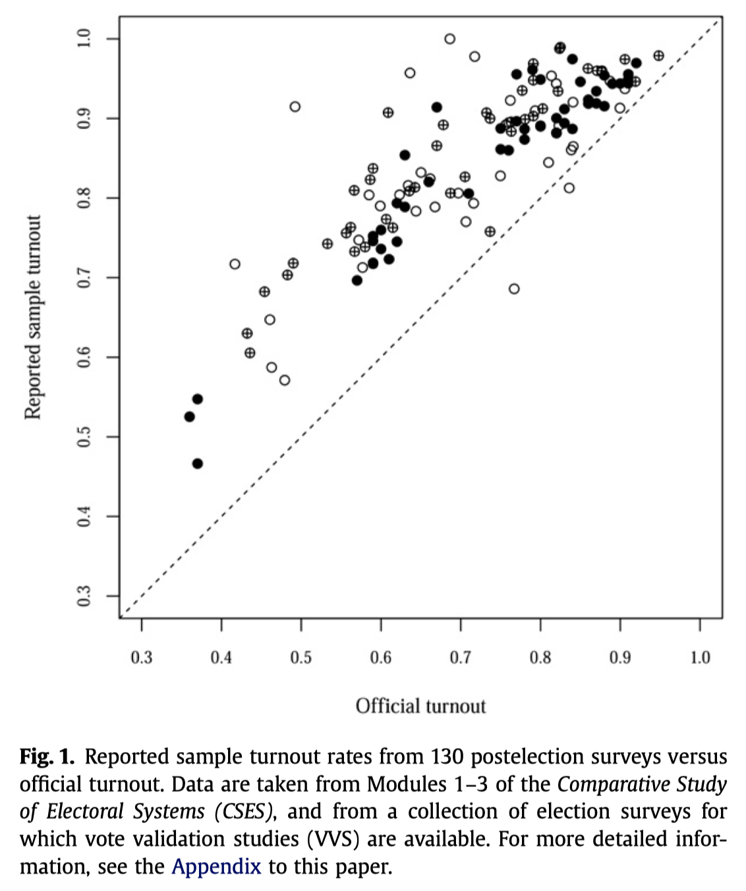
</div>


---
class: inverse, center, middle
name: takeaways

# Take-aways
<html><div style='float:left'></div><hr color='#EB811B' size=1px style="width:1000px; margin:auto;"/></html>


---
# Take surveys with a pinch of salt

<div align="center">
<br><br><br><br>

</div>


---
# Session takeaways

.pull-left[
## Key lessons

1. **Sample size matters — but bias matters more.** A biased sample of n = 1M is worse than an unbiased sample of n = 1,000.
2. **"Representative" is not a magic word.** Always ask: representative of what? Verified how?
3. **The margin of error only captures random error.** Systematic errors (coverage, nonresponse, measurement) are not included.
4. **Weighting helps — but has limits.** It can adjust for known imbalances but cannot fix coverage gaps.
5. **Question wording shapes answers.** Always check the exact wording before reporting.
6. **MRP is powerful but opaque.** Know that the poll you're reporting may be partly a model.
]

.pull-right[
## What a data journalist should do

- Always look for the **methodology statement** before reporting survey results.
- Report the **margin of error** and sample size alongside any point estimate.
- Be cautious with **subgroup estimates** — check the subgroup n.
- Be skeptical of **opt-in surveys** presented as representative polls.
- Use **multiple sources** — if three independent polls agree, the signal is stronger.
- Understand the basics of **weighting and MRP** so you can evaluate modern polling methods.
]


---
# Don't contribute to this...

<div align="center">
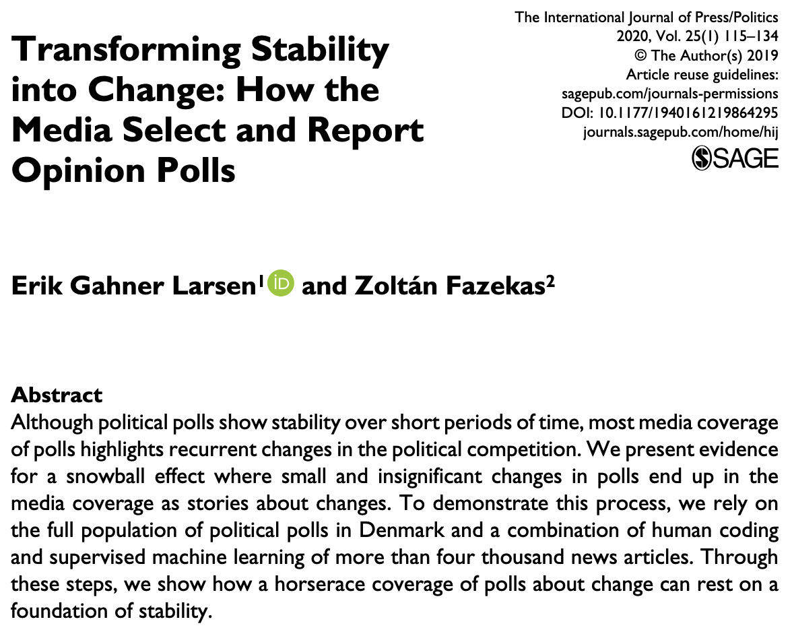
</div>
`Source` [Larsen and Fazekas](https://journals.sagepub.com/doi/10.1177/1940161219864295)


---
# Resources

.pull-left[
## Books

- **Groves et al. (2009)**: *Survey Methodology*, 2nd edition. The comprehensive reference — chapters on sampling, nonresponse, and measurement are excellent.
- **Lohr (2022)**: *Sampling: Design and Analysis*, 3rd edition. More technical; great for sampling design and estimation.
- **Wolf & Joye (2016)**: *The SAGE Handbook of Survey Methodology*. Good overview chapters on total survey error, modes, and questionnaire design.
]

.pull-right[
## Online resources

- [AAPOR Transparency Initiative](https://aapor.org/standards-and-ethics/transparency-initiative/) — standards for survey disclosure.
- [Pew Research Methods](https://www.pewresearch.org/methods/) — detailed methodology reports.
- [The Economist's MRP model](https://www.economist.com/interactive/us-2024-election/prediction-model/president/how-this-works) — explanation of their election forecasting approach.
- [Andrew Gelman's blog](https://statmodeling.stat.columbia.edu/) — commentary on polling methodology and MRP.
- [Lauren Kennedy & Jonah Gabry: MRP primer](https://mc-stan.org/rstanarm/articles/mrp.html) — accessible tutorial on MRP with rstanarm.

## R packages

- `survey` / `srvyr` — analyzing complex survey data (design effects, weights, stratification).
- `anesrake` — raking/calibration weights.
- `WeightIt` — unified interface for survey weighting methods.
]
