background-image: url(pics/star-trek-space.jpg)
background-size: contain
background-position: center
background-color: #000000

```{css, echo=FALSE}
@media print {
  .has-continuation {
    display: block !important;
  }
}
```

```{r setup, include=FALSE}
options(htmltools.dir.version = FALSE)
library(knitr)
opts_chunk$set(
  prompt = T, fig.align = "center",
  dpi = 300, cache = T,
  engine.opts = list(bash = "-l")
)
knit_hooks$set(
  prompt = function(before, options, envir) {
    options(
      prompt = if (options$engine %in% c('sh', 'bash')) '$ ' else 'R> ',
      continue = if (options$engine %in% c('sh', 'bash')) '$ ' else '+ '
    )
  })
library(tidyverse)
library(fontawesome)
```


# Space. The final frontier...


---
# Today

</br></br>

1. [Why space matters for journalism](#classics)

2. [Spatial data fundamentals](#spatial)

3. [When geojournalism goes wrong](#wrong)

4. [Maps: Dos and Don'ts](#dosndonts)

5. [Discussion](#discussion)


---
class: inverse, center, middle
name: spatial

# Why space matters for journalism
<html><div style='float:left'></div><hr color='#EB811B' size=1px style="width:1000px; margin:auto;"/></html>


---
# Why space matters

<br><br><br>

<div align="center" style="font-size:2em;">
<b>The "where" of a story is central to journalism.</b>
</div>

<br><br><br><br><br><br><br>

Gomes, A., Brito, E., Morais, L. A., & Ferreira, N. (2025). How Do Data Journalists Design Maps to Tell Stories? *IEEE Transactions on Visualization and Computer Graphics.*

N. Usher. News cartography and epistemic authority in the era of big data: Journalists as map-makers, map-users, and map-subjects. *New Media & Society*, 22(2):247–263, 2020.

---
# 1854 Broad Street cholera outbreak

.pull-left[
<div align="center">
<br>
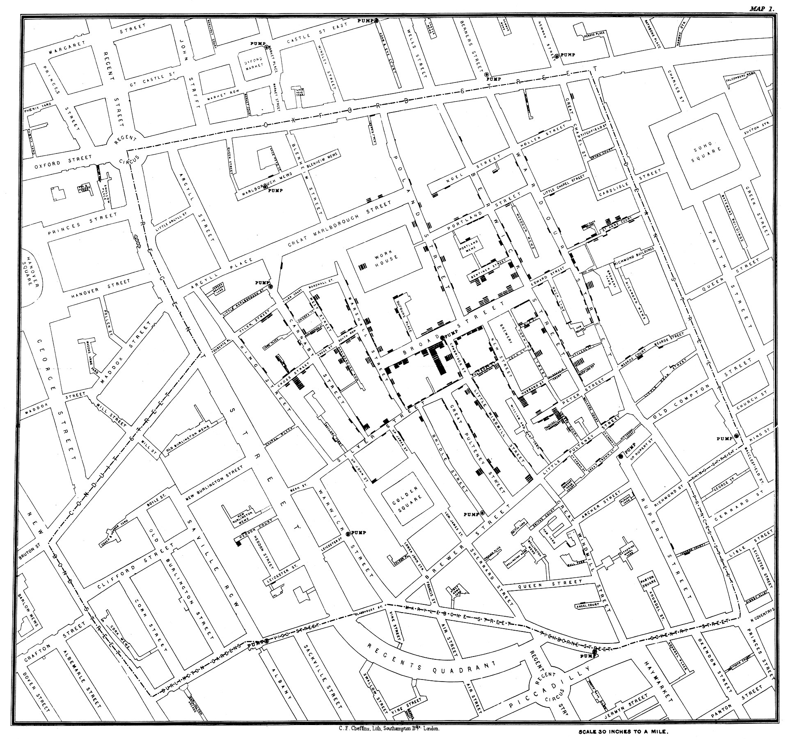
</div>
]

.pull-right[
- One of the most famous data viusalizations of all times: [John Snow](https://en.wikipedia.org/wiki/John_Snow)'s cholera case map.
- The [Broad Street cholera outbreak](https://en.wikipedia.org/wiki/1854_Broad_Street_cholera_outbreak) in in Soho, London in 1854 was studied by physician John Snow to study its causes (rival hypotheses: germ-contaminated water vs. airborne transmission).
- The germ theory was not established at this point but the map helped highlight how cases clustered around a contaminated pump (which was by far not the only source of contaminated water though).
- Fun fact: this is what doing good data viz gives you:

<div align="center">

</div>
]


---
# Electoral geography

<div align="center">
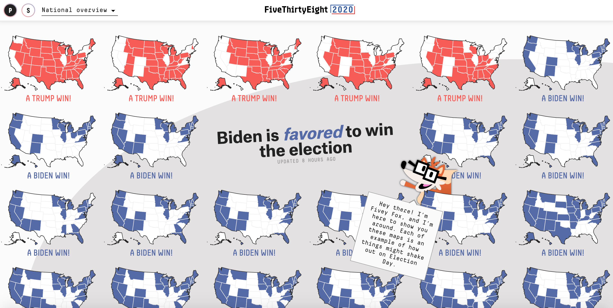
</div>


---
# Electoral geography

<div align="center">
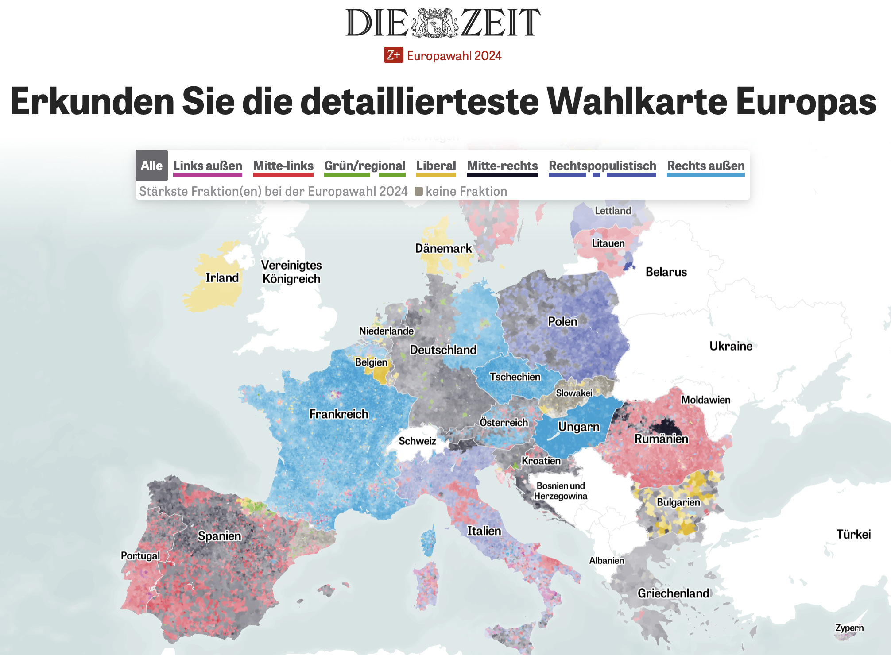
</div>

`Source` [ZEIT Online](https://www.zeit.de/politik/ausland/2024-07/europawahl-2024-ergebnisse-gemeinden-laender-karte?freebie=220fa61c)


---
# Conflict zones

<div align="center">
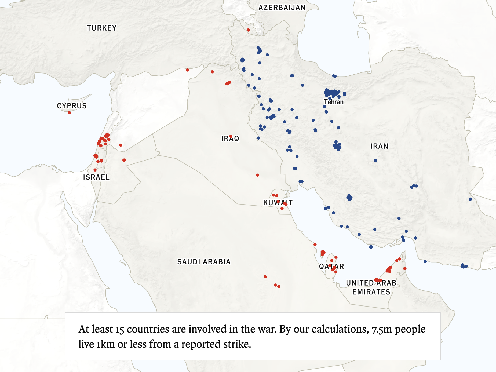
</div>

`Source` [The Economist](https://www.economist.com/interactive/middle-east-and-africa/2026/03/06/the-iran-war-has-entered-a-new-phase)

---
# Conflict zones

<div align="center">
<video width="900" autoplay muted loop>
  <source src="pics/zeit-strait-hormus.mp4" type="video/mp4">
</video>
</div>

`Source` [Die Zeit](https://www.zeit.de/wirtschaft/2026-03/strasse-von-hormus-schifffahrt-oeltanker-frachter-iran?freebie=640aed06)


---
# The design space of journalistic maps

<div align="center">
<br>
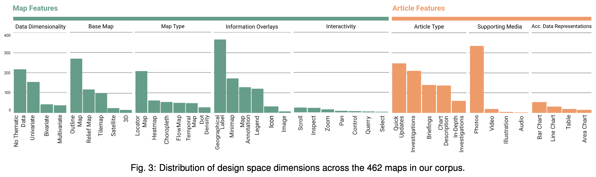
</div>

`Source` [Gomes et al. (2025); "How do Data Journalists Design Maps to Tell Stories?"](https://arxiv.org/abs/2508.10903)


---
class: inverse, center, middle
name: spatial

# Spatial data fundamentals
<html><div style='float:left'></div><hr color='#EB811B' size=1px style="width:1000px; margin:auto;"/></html>


---
# Conceptualizations of space

.pull-left-wide2[
## Data models in (sort-of) two-dimensional space

- **Point**: single point location, such as a GPS reading or geocoded address
- **Line**: set of ordered points, connected by straight line segments
- **Polygon**: area, marked by one or more enclosing lines, possibly containing holes
- **Grid**: collection of points or rectangular cells, organized in a regular lattice

Things get more complicated when we assume a more realistic representation of the space that interests us most, i.e. more or less round planet Earth.
]

.pull-right-small2[
<div align="center">
<br>
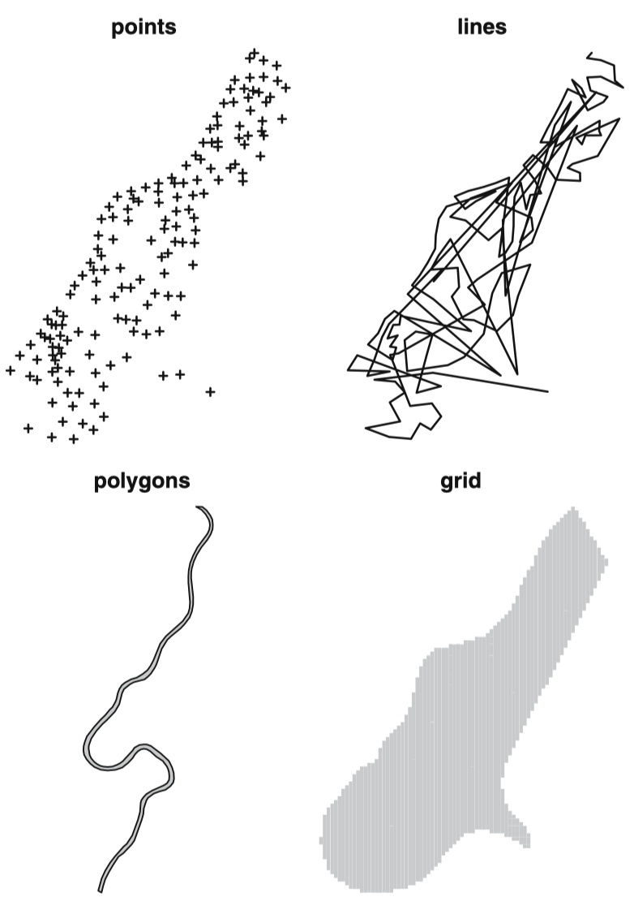
</div>
]


---
# Conceptualizations of space (cont.)

## Continuous

- Areal distribution of characteristics
- Measuring points (areas, spaces); resolution largely arbitrary (e.g. determined by the location and density of measuring stations)
- Display and analysis often as contour or raster data
- More prevalent in the natural and geosciences

## Discrete

- (Aggregated) characteristics of fixed spatial objects (e.g. political-administrative units)
- Display and analysis often as point, line and polygon data
- Particularly popular in the social sciences


---
# Spatial data types

.pull-left-wide[
## Flavors of spatial data

- **Shape** data a.k.a. 'points' and 'polygons'
- **Raster** data a.k.a. 'pixels'

Today we'll only deal with polygon data.
]

.pull-right-small[
<div align="center">
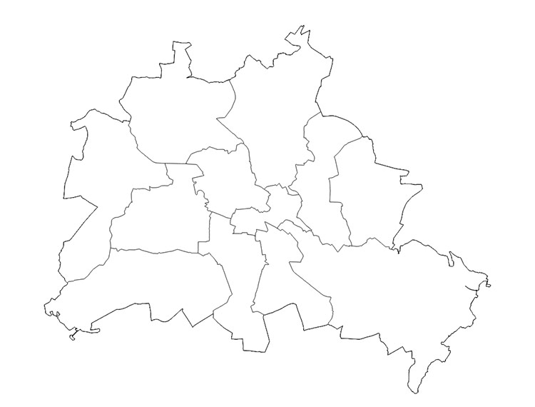 <br>
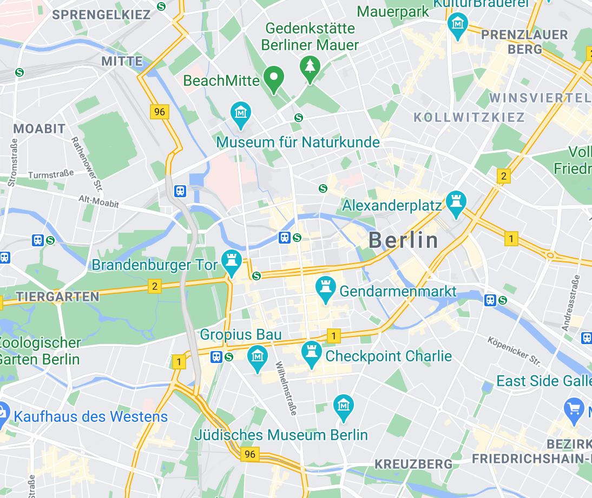 <br>
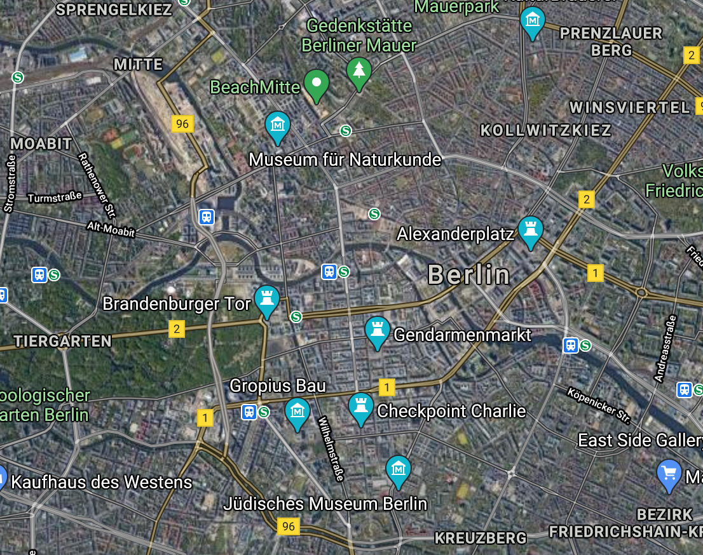
</div>
]


---
# Spatial dependence

.pull-left-wide2[
## Tobler's First Law of Geography

**"Everything is related to everything else, but near things are more related than distant things."**

## 
- Analogy between time-series and spatial data (but: time is uni-dimensional and -directional)
- Spatial econometrics is about how to address spatial dependence in statistical inference
- Think about: spatial lags; spatial interactions; spatial spillovers

]

.pull-right-small2[
<div align="center">
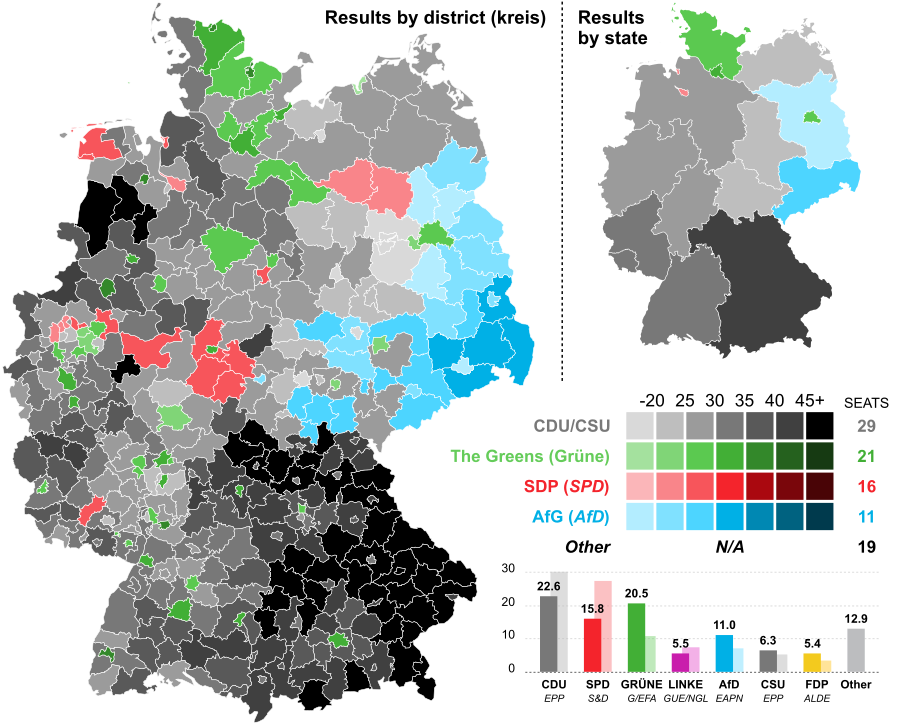
<br>
<small><em>Source:</em> Erinthecute; <a href="https://w.wiki/e8n">w.wiki/e8n</a></small>
</div>
]


---
# Conceptualizations of distance

**Continuous**
- (Euclidean) distance between points, polygons (centroids!)
- Transformations if theoretically appropriate

<br>

**Discrete**
- Based on concepts of contiguity
- "Does Polygon A share a border with Polygon B?"; "Does Polygon A touch Polygon B?"


---
# Continuous distances

<div align="center">
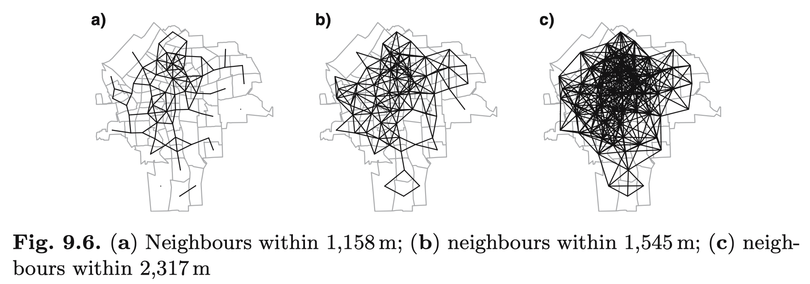
<br>
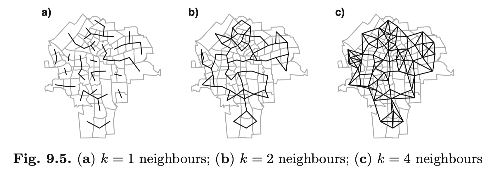
</div>


---
# Discrete distances

<div align="center">
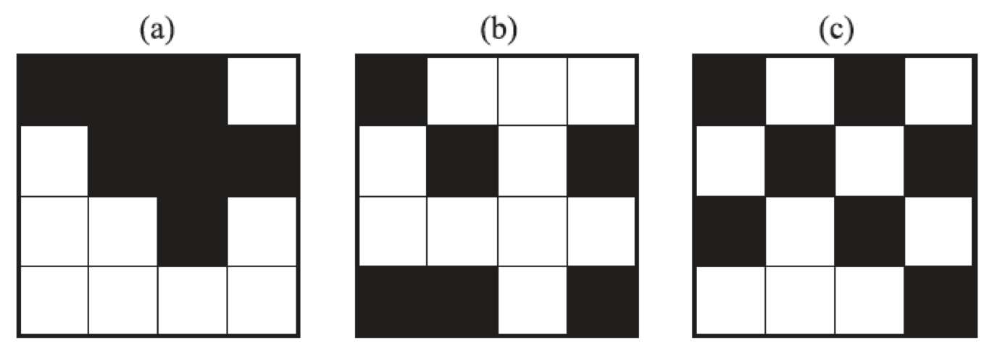
<br>
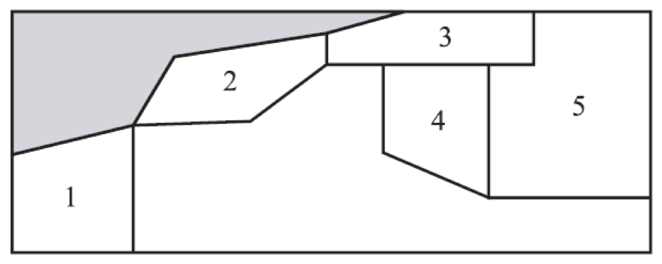
</div>


---
# Discrete distances (cont.)

<div align="center">
<br>
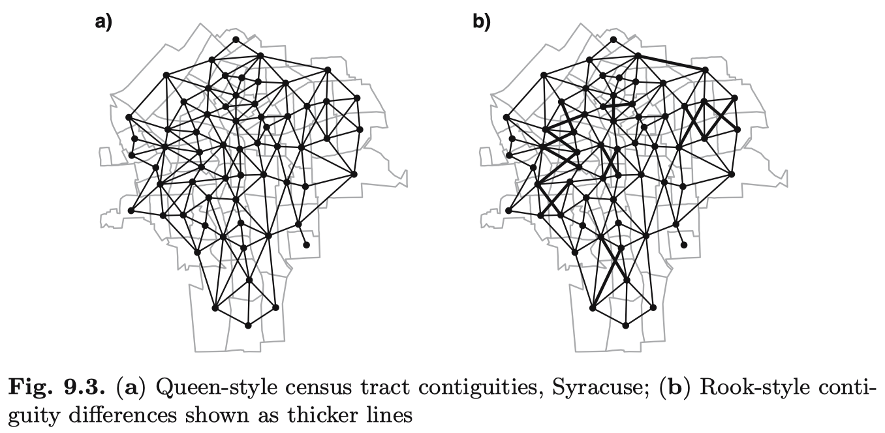
</div>


---
class: inverse, center, middle
name: wrong

# When geojournalism goes wrong
<html><div style='float:left'></div><hr color='#EB811B' size=1px style="width:1000px; margin:auto;"/></html>


---
# Fox News 2009

<div align="center">
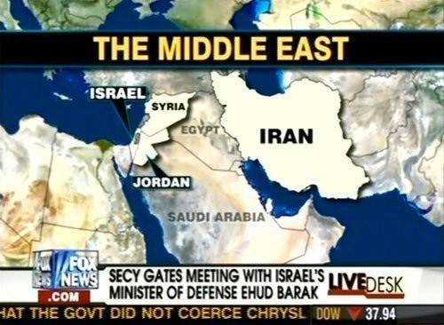
<a href="https://www.huffpost.com/entry/fox-news-cant-find-egypt-map_n_816540" style="font-size:0.8em;">Source</a>
</div>


---
# WSJ 2012

<div align="center">
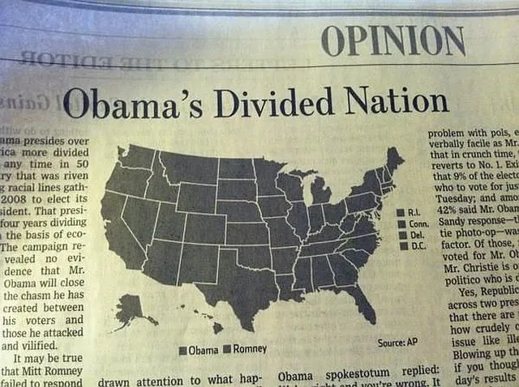
<a href="https://www.vox.com/2015/2/18/8056325/bad-maps" style="font-size:0.8em;">Source</a>
</div>

.center[
<small>Fox News. Alabama and Mississippi switched on a U.S. map.</small>
]


---
# Projection fail: the Mercator problem

<div align="center">
<br>

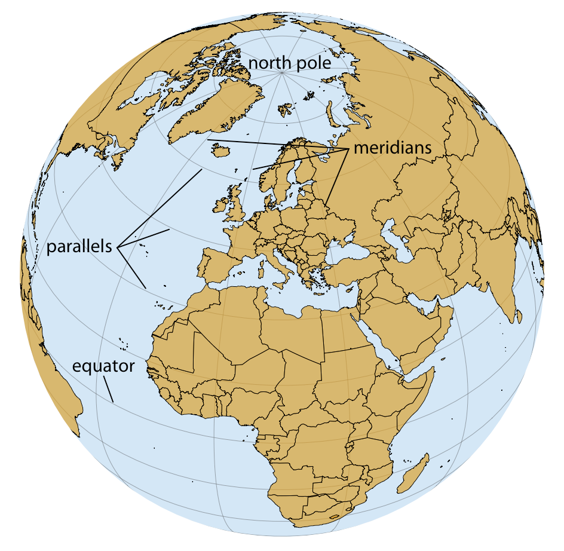

</div>

.center[
<small>On a Mercator map, Greenland appears the same size as Africa — but Africa is actually 14× larger. Try [thetruesize.com](https://thetruesize.com).</small>
]


---
# The world forgets New Zealand

<div align="center">
<br>

</div>

.center[
<small>New Zealand is so frequently omitted from world maps that there's an entire subreddit dedicated to it: [r/MapsWithoutNZ](https://www.reddit.com/r/MapsWithoutNZ/).</small>
]


---
class: inverse, center, middle
name: dosndonts

# Maps: Dos and don'ts
<html><div style='float:left'></div><hr color='#EB811B' size=1px style="width:1000px; margin:auto;"/></html>


---
# Maps are beautiful ...

<div align="center">
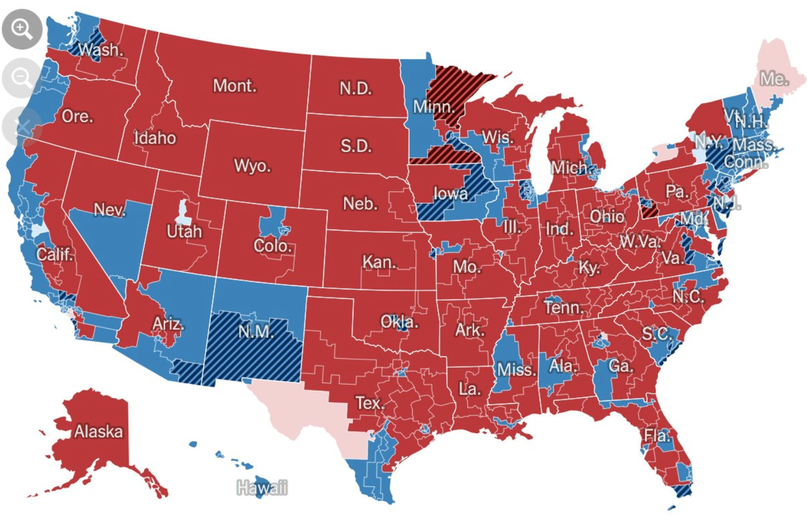
</div>

.center[
<small>2019 US Midterm Election results; source: nytimes.com</small>
]


---
# ... but sometimes misleading

<div align="center">
<br>
 &emsp;
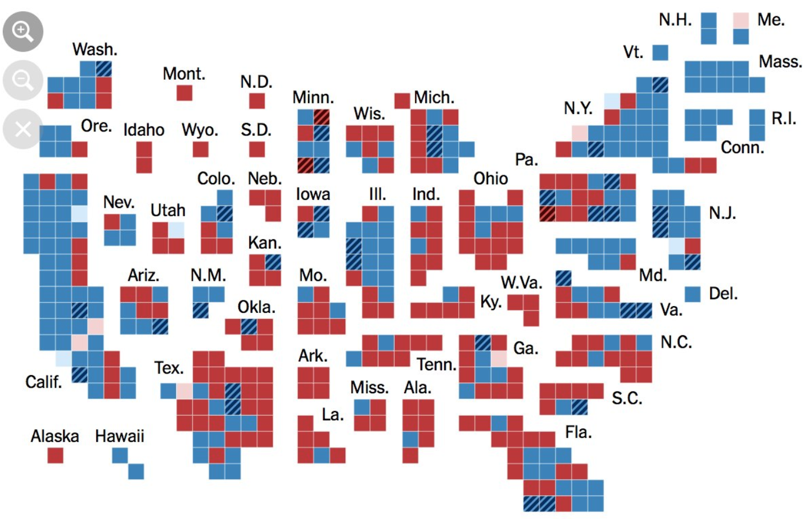
</div>

##  Don't confuse area size with actual data of interest

Large geographic areas attract attention regardless of their data values. Consider cartograms, hex tile maps, or dot density maps to counteract this.</small>


---
# Consider if a map is the right choice

<div align="center">
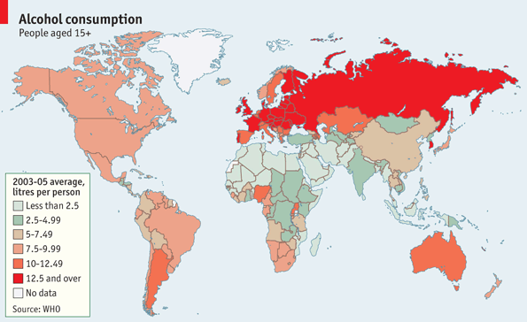 &emsp;
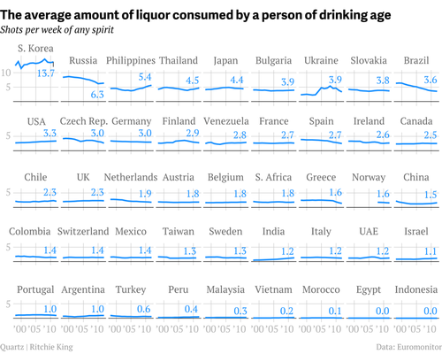
</div>

## Maps help highlight geographical patterns, but is that your story?
Also discussed [here](https://statmodeling.stat.columbia.edu/2014/04/10/small-multiples-lineplots-maps-ok-always-yes-case/). The small multiple plot on the right does a much better job at showing the trends over time and comparing across countries, while the map on the left is more visually striking but less informative. The map also exaggerates the differences between countries due to the varying sizes of the areas.

---
# Consider if a map is the right choice

<div align="center">
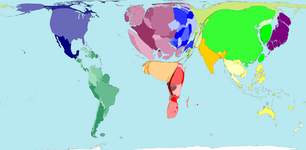 &emsp;

</div>

## Maps help highlight geographical patterns, but is that your story?
Also discussed [here](https://statmodeling.stat.columbia.edu/2014/04/10/small-multiples-lineplots-maps-ok-always-yes-case/). The small multiple plot on the right does a much better job at showing the trends over time and comparing across countries, while the map on the left is more visually striking but less informative. The map also exaggerates the differences between countries due to the varying sizes of the areas. A *cartogram* is almost never the right choice.


---
# Why not try small map multiples?

.pull-left[
<div align="center">
<br>
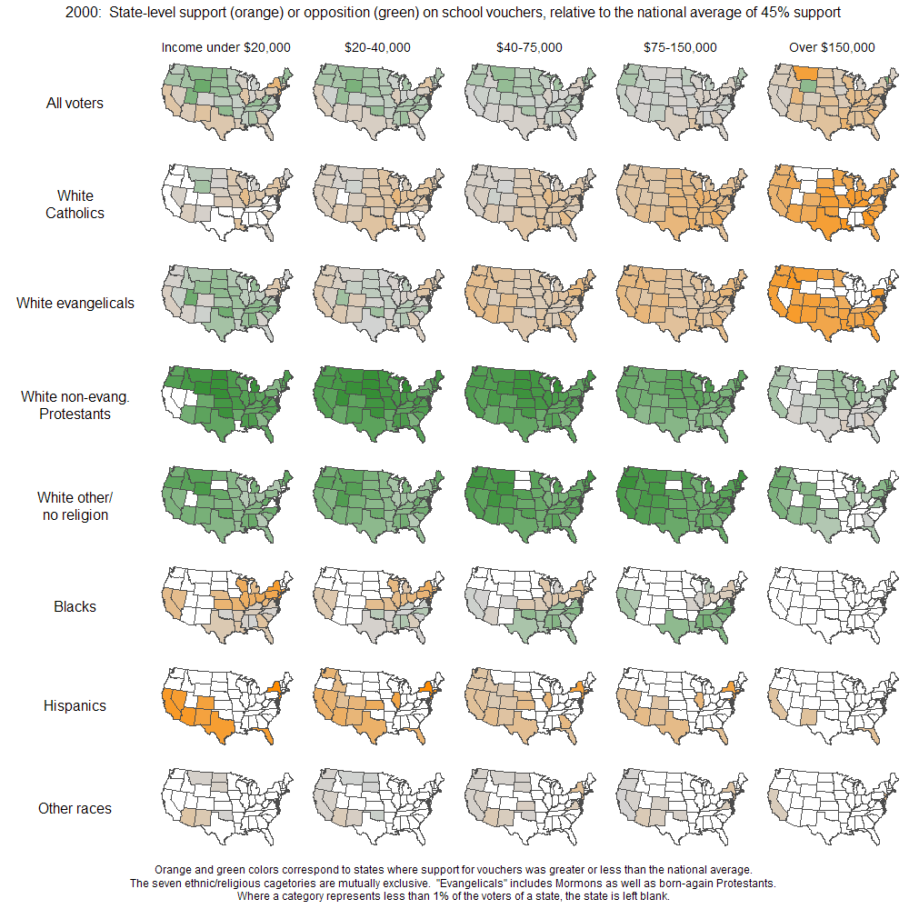
</div>
]


.pull-right[
<div align="center">
<br>
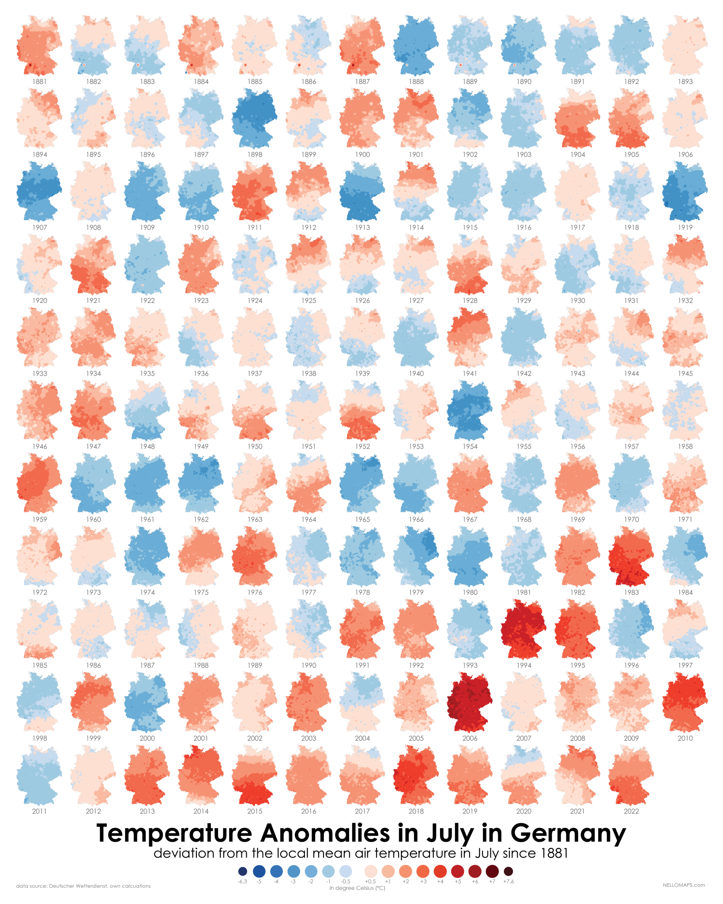
</div>
]


---
# Use color scales wisely

.pull-left[
## Three fundamental use cases for color in data visualizations:
  1. We can use color to distinguish groups of data from each other;
  2. We can use color to **represent data values**; and 
  3. We can use color to highlight.
  
Use [ColorBrewer](https://colorbrewer2.org/) to choose palettes.
]

.pull-right[
<div align="center">
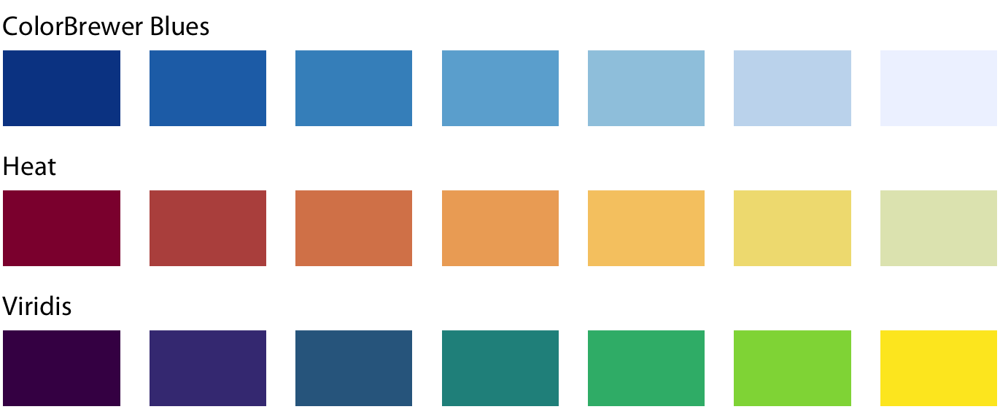
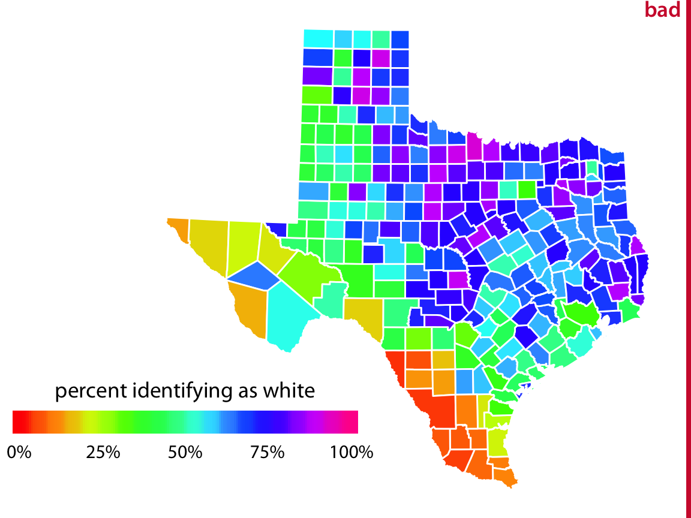 &emsp;


</div>
]


---
# Minard's map of Napoleon's March

<div align="center">
<br>
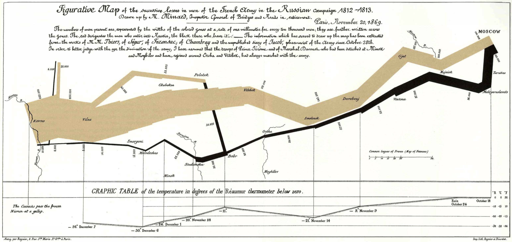
</div>

## Keep things simple


---
# Normalize your data

<div align="center">
<br>
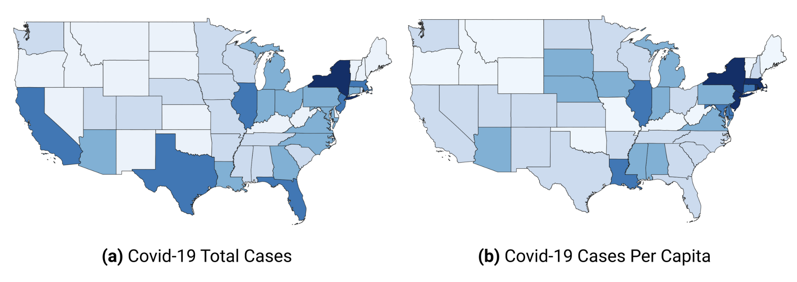
</div>

## Mapping raw counts in choropleths can be misleading

Absolute counts can be misleading - large units/states dominate (left plot). Right: per capita rate. [Source](https://handsondataviz.org/normalize-choropleth.html)


---
# Do: Add context and sources

<div align="center">
<br>

</div>

.center[
<small>Good journalistic maps include: a title that tells the story, a legend, a data source, a scale bar or north arrow when needed, and annotations for key patterns.</small>
]


---
# Don't: Forget about your projection

<div align="center">
<br>

</div>

.center[
<small>Mercator for a world thematic map distorts areas at the poles. Use equal-area projections (e.g., Robinson, Equal Earth) for world maps showing data.</small>
]


---
# Do: Use interactivity wisely

<div align="center">
<br>

</div>

.center[
<small>Tooltips, zoom, and filter let readers explore. But don't make interactivity a crutch for poor design — the default view should already tell the story.</small>
]


---
class: inverse, center, middle
name: discussion

# Discussion
<html><div style='float:left'></div><hr color='#EB811B' size=1px style="width:1000px; margin:auto;"/></html>


---
# Discuss

<div align="center">
<br>
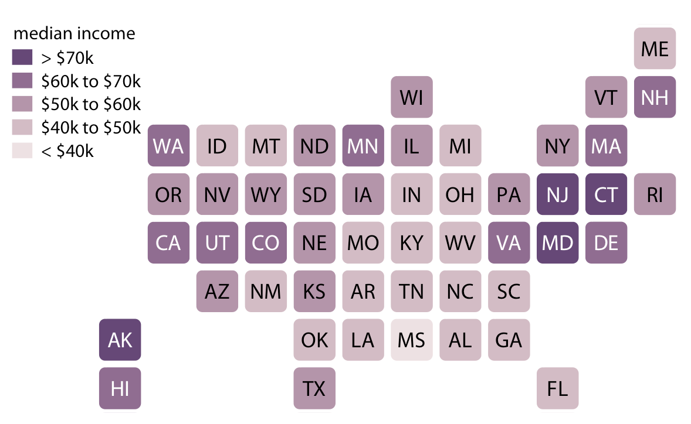
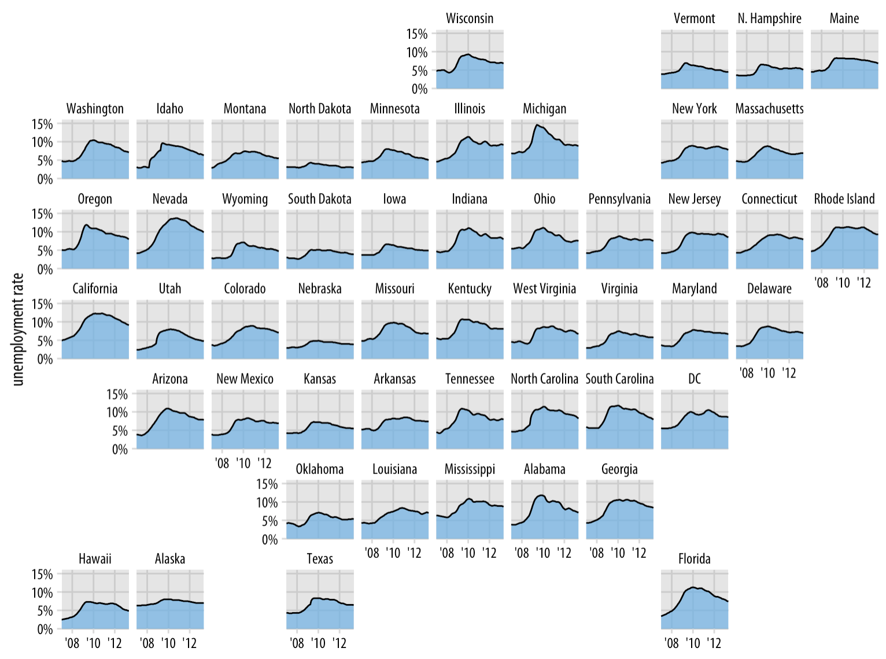
</div>


---
# Summary: mapping checklist

.pull-left[
## Do
- Normalize data (per capita, per km²)
- Use sequential or diverging color scales
- Include legend, source, title
- Consider if a map is actually the best format
- Test for colorblind accessibility
- Use appropriate projections for the scale
- Show your sources and methodology
]

.pull-right[
## Don't
- Map raw counts on a choropleth
- Use rainbow or arbitrary color scales
- Let large areas dominate when they shouldn't
- Forget New Zealand (or other countries)
- Use 3D when 2D would do
- Assume readers know where places are — add labels
- Forget to check your borders and labels (!)
]


