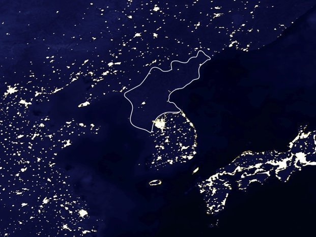
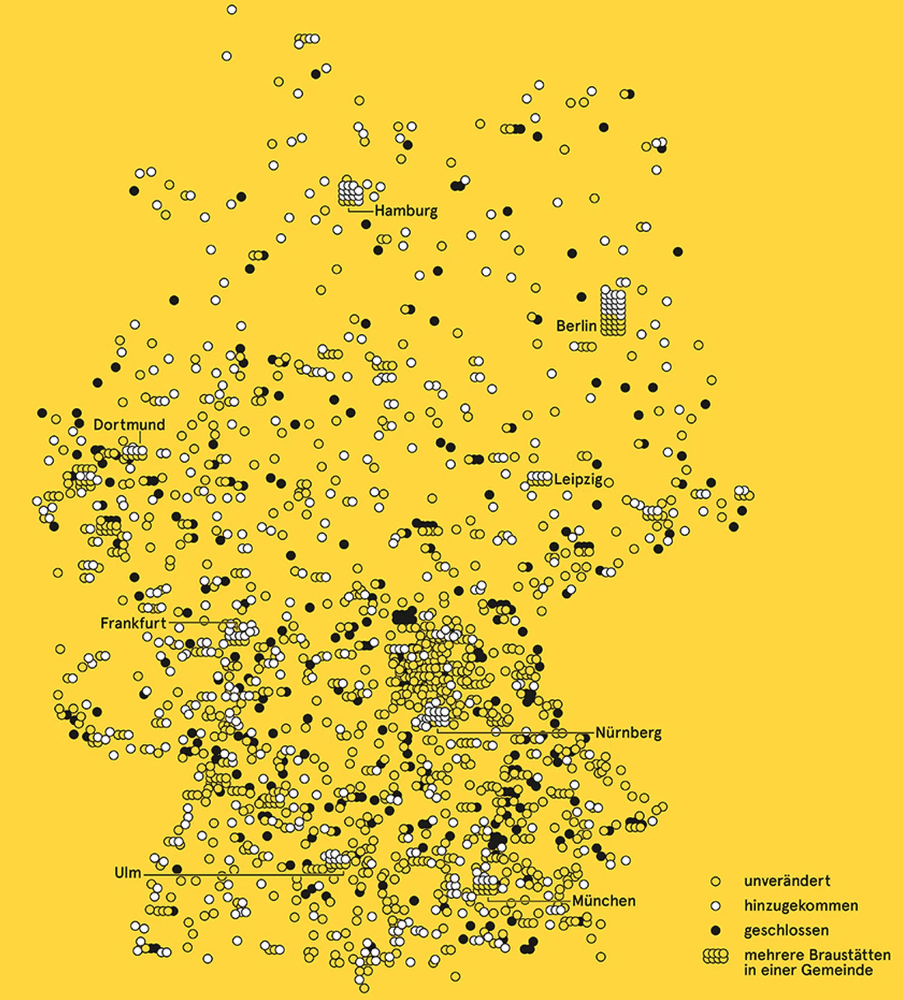

background-image: url(pics/star-trek-space.jpg)
background-size: contain
background-position: center
background-color: #000000

```{css, echo=FALSE}
@media print {
  .has-continuation {
    display: block !important;
  }
}
```

```{r setup, include=FALSE}
options(htmltools.dir.version = FALSE)
library(knitr)
opts_chunk$set(
  prompt = T, fig.align = "center",
  dpi = 300, cache = T,
  engine.opts = list(bash = "-l")
)
knit_hooks$set(
  prompt = function(before, options, envir) {
    options(
      prompt = if (options$engine %in% c('sh', 'bash')) '$ ' else 'R> ',
      continue = if (options$engine %in% c('sh', 'bash')) '$ ' else '+ '
    )
  })
library(tidyverse)
library(fontawesome)
```


# Space. The final frontier...


---
# Today

</br></br>

1. [Why space matters for journalism](#classics)

2. [Spatial data fundamentals](#spatial)

3. [Maps: Dos and Don'ts](#dosndonts)

4. [When geojournalism goes wrong](#wrong)

5. [Maps for storytelling](#storytelling)

6. [Mapping: Practical do's and don'ts](#practical)


---
class: inverse, center, middle
name: spatial

# Why space matters for journalism
<html><div style='float:left'></div><hr color='#EB811B' size=1px style="width:1000px; margin:auto;"/></html>


---
# Why space matters

<br><br><br>

<div align="center" style="font-size:2em;">
<b>The "where" of a story is central to journalism.</b>
</div>

<br><br><br><br><br><br><br>

Gomes, A., Brito, E., Morais, L. A., & Ferreira, N. (2025). How Do Data Journalists Design Maps to Tell Stories? *IEEE Transactions on Visualization and Computer Graphics.*

N. Usher. News cartography and epistemic authority in the era of big data: Journalists as map-makers, map-users, and map-subjects. *New Media & Society*, 22(2):247–263, 2020.

---
# 1854 Broad Street cholera outbreak

.pull-left[
<div align="center">
<br>

</div>
]

.pull-right[
- One of the most famous data viusalizations of all times: [John Snow](https://en.wikipedia.org/wiki/John_Snow)'s cholera case map.
- The [Broad Street cholera outbreak](https://en.wikipedia.org/wiki/1854_Broad_Street_cholera_outbreak) in in Soho, London in 1854 was studied by physician John Snow to study its causes (rival hypotheses: germ-contaminated water vs. airborne transmission).
- The germ theory was not established at this point but the map helped highlight how cases clustered around a contaminated pump (which was by far not the only source of contaminated water though).
- Fun fact: this is what doing good data viz gives you:

<div align="center">

</div>
]


---
# Why spatial data?

<div align="center">
<br>

</div>


---
# Why spatial data?

<div align="center">
<br>
 &nbsp;
 &nbsp;

</div>

.center[
Light emissions in NK &emsp; Breweries in Germany &emsp; You're being tracked
]


---
class: inverse, center, middle
name: spatial

# Spatial data fundamentals
<html><div style='float:left'></div><hr color='#EB811B' size=1px style="width:1000px; margin:auto;"/></html>


---
# Spatial data types

.pull-left[
Spatial data comes in two flavors:

- **Shape** data a.k.a. 'points' and 'polygons'
- **Raster** data a.k.a. 'pixels'

Today we'll only deal with polygon data.
]

.pull-right[
<div align="center">
 &nbsp;
 &nbsp;

</div>

.center[
Polygon &emsp; Raster (with vector "feel") &emsp; Raster (satellite)
]
]


---
# Spatial dependence

.pull-left-wide2[
## Tobler's First Law of Geography

**"Everything is related to everything else, but near things are more related than distant things."**

## 
- Analogy between time-series and spatial data (but: time is uni-dimensional and -directional)
- Spatial econometrics is about how to address spatial dependence in statistical inference
- Think about: spatial lags; spatial interactions; spatial spillovers

]

.pull-right-small2[
<div align="center">

<br>
<small><em>Source:</em> Erinthecute; <a href="https://w.wiki/e8n">w.wiki/e8n</a></small>
</div>
]


---
# Conceptualizations of space

.pull-left-wide2[
Data models in (sort-of) two-dimensional space

- **Point**: single point location, such as a GPS reading or geocoded address
- **Line**: set of ordered points, connected by straight line segments
- **Polygon**: area, marked by one or more enclosing lines, possibly containing holes
- **Grid**: collection of points or rectangular cells, organized in a regular lattice

Things get more complicated when we assume a more realistic representation of the space that interests us most, i.e. more or less round planet Earth.
]

.pull-right-small2[
<div align="center">
<br>

</div>
]


---
# Conceptualizations of space (cont.)

**Continuous**
- Areal distribution of characteristics
- Measuring points (areas, spaces); resolution largely arbitrary (e.g. determined by the location and density of measuring stations)
- Display and analysis often as contour or raster data
- More prevalent in the natural and geosciences

**Discrete**
- (Aggregated) characteristics of fixed spatial objects (e.g. political-administrative units)
- Display and analysis often as point, line and polygon data
- Particularly popular in the social sciences


---
# Conceptualizations of distance

**Continuous**
- (Euclidean) distance between points, polygons (centroids!)
- Transformations if theoretically appropriate

<br>

**Discrete**
- Based on concepts of contiguity
- "Does Polygon A share a border with Polygon B?"; "Does Polygon A touch Polygon B?"


---
# Continuous distances

<div align="center">

<br>

</div>


---
# Discrete distances

<div align="center">

<br>

</div>


---
# Discrete distances (cont.)

<div align="center">
<br>

</div>


---
class: inverse, center, middle
name: dosndonts

# Maps: Dos and don'ts
<html><div style='float:left'></div><hr color='#EB811B' size=1px style="width:1000px; margin:auto;"/></html>


---
# Remember: maps are beautiful ...

<div align="center">

</div>

.center[
<small>2019 US Midterm Election results; source: nytimes.com</small>
]


---
# ... but sometimes misleading

<div align="center">
 &emsp;

</div>

.center[
<small>2019 US Midterm Election results; source: nytimes.com</small>
]


---
# Visualizing geospatial data
<div align="center">
<br>

</div>


---
# Colors

.pull-left[
- There are three fundamental use cases for color in data visualizations:
  1. We can use color to distinguish groups of data from each other;
  2. We can use color to **represent data values**; and 
  3. We can use color to highlight.
]

.pull-right[
<div align="center">


</div>
]


---
# Small multiples (cont.)

.pull-left[
- Check out the example on the right, which was also discussed [here](https://statmodeling.stat.columbia.edu/2014/04/10/small-multiples-lineplots-maps-ok-always-yes-case/) and [there](https://junkcharts.typepad.com/junk_charts/2014/02/small-multiples-with-simple-axes.html).
- What they did right (by Kaiser Fung):
  - Did not put the data on a map
  - Ordered the countries by the most recent data point rather than alphabetically
  - Scale labels are found only on outer edge of the chart area, rather than one set per panel
  - Only used three labels for the 11 years
  - Did not overdo the vertical scale either
  - The nicest feature was the XL scale applied only to South Korea. This destroys the small-multiples principle but draws attention to the top left corner, where the designer wants our eyes to go.
- Sometimes maps are not a good alternative.
]

.pull-right[
<div align="center">
<br>


</div>
]


---
# Small multiples (cont.)

.pull-left[
- Check out the example on the right, which was also discussed [here](https://statmodeling.stat.columbia.edu/2014/04/10/small-multiples-lineplots-maps-ok-always-yes-case/) and [there](https://junkcharts.typepad.com/junk_charts/2014/02/small-multiples-with-simple-axes.html).
- What they did right (by Kaiser Fung):
  - Did not put the data on a map
  - Ordered the countries by the most recent data point rather than alphabetically
  - Scale labels are found only on outer edge of the chart area, rather than one set per panel
  - Only used three labels for the 11 years
  - Did not overdo the vertical scale either
  - The nicest feature was the XL scale applied only to South Korea. This destroys the small-multiples principle but draws attention to the top left corner, where the designer wants our eyes to go.
]

.pull-right[
<div align="center">
<br>

</div>
]

---
# Small multiples (cont.)

.pull-left[
- Check out the example on the right, which was also discussed [here](https://statmodeling.stat.columbia.edu/2014/04/10/small-multiples-lineplots-maps-ok-always-yes-case/) and [there](https://junkcharts.typepad.com/junk_charts/2014/02/small-multiples-with-simple-axes.html).
- What they did right (by Kaiser Fung):
  - Did not put the data on a map
  - Ordered the countries by the most recent data point rather than alphabetically
  - Scale labels are found only on outer edge of the chart area, rather than one set per panel
  - Only used three labels for the 11 years
  - Did not overdo the vertical scale either
  - The nicest feature was the XL scale applied only to South Korea. This destroys the small-multiples principle but draws attention to the top left corner, where the designer wants our eyes to go.
- Sometimes maps are not a good alternative.
- But you can do small multiples of maps!
]

.pull-right[
<div align="center">
<br>

</div>
]


---
# Minard's map of Napoleon's March

<div align="center">
<br>

</div>


---
class: inverse, center, middle
name: wrong

# When geojournalism goes wrong
<html><div style='float:left'></div><hr color='#EB811B' size=1px style="width:1000px; margin:auto;"/></html>


---
# Wrong labels: Fox News places Iraq in Egypt

<div align="center">
<br>

</div>

.center[
<small>Fox News, 2011. Iraq labeled as Egypt on a map of the Middle East.</small>
]


---
# Wrong labels: CNN places Tripoli in Lebanon

<div align="center">
<br>

</div>

.center[
<small>CNN, 2011. During coverage of the Libyan conflict, Tripoli was placed in Lebanon — 2,000 km off.</small>
]


---
# Wrong labels: Fox News swaps U.S. states

<div align="center">
<br>

</div>

.center[
<small>Fox News. Alabama and Mississippi switched on a U.S. map.</small>
]


---
# Wrong borders: Google Maps and the Nicaragua–Costa Rica dispute

<div align="center">
<br>

</div>

.center[
<small>In 2010, a faulty Google Maps border led Nicaragua to invade Costa Rican territory. The ICJ settled the dispute in 2015.</small>
]


---
# Wrong borders: Kashmir on Google Maps

<div align="center">
<br>

</div>

.center[
<small>Google Maps shows different borders for Kashmir depending on whether you search from India or the US.</small>
]


---
# Projection fail: the Mercator problem

<div align="center">
<br>

</div>

.center[
<small>On a Mercator map, Greenland appears the same size as Africa — but Africa is actually 14× larger. Try [thetruesize.com](https://thetruesize.com).</small>
]


---
# The world forgets New Zealand

<div align="center">
<br>

</div>

.center[
<small>New Zealand is so frequently omitted from world maps that there's an entire subreddit dedicated to it: [r/MapsWithoutNZ](https://www.reddit.com/r/MapsWithoutNZ/).</small>
]


---
class: inverse, center, middle
name: storytelling

# Maps for storytelling
<html><div style='float:left'></div><hr color='#EB811B' size=1px style="width:1000px; margin:auto;"/></html>


---
# The design space of journalistic maps

<div align="center">
<br>

</div>

.center[
<small>Fig. 3 from Gomes et al. (2025), "How do Data Journalists Design Maps to Tell Stories?", IEEE TVCG. Eight dimensions: story type, map type, visual encoding, interactivity, basemap, geographic scale, annotation, and data source.</small>
]


---
# Polygon data: election results by county

<div align="center">
<br>

</div>

.center[
<small>NYT, 2020 U.S. election results by county. Vector polygons with color encoding vote margin.</small>
]


---
# Raster / satellite data: light emissions

<div align="center">
<br>

</div>

.center[
<small>NASA Earth Observatory: composite nighttime lights. Raster data from satellite imagery reveals economic activity, urbanization, and conflict zones.</small>
]


---
# Satellite imagery: before and after

<div align="center">
<br>

</div>

.center[
<small>Satellite imagery comparison (e.g., NYT/Reuters). Before-and-after views reveal destruction, deforestation, or urban growth.</small>
]


---
# Dot density map

<div align="center">
<br>

</div>

.center[
<small>NYT "The Racial Dot Map" (University of Virginia): one dot per person, colored by race/ethnicity. Reveals segregation patterns invisible in choropleth maps.</small>
]


---
# Heatmap

<div align="center">
<br>

</div>

.center[
<small>Strava Global Heatmap: aggregated GPS traces from millions of athletes. Accidentally revealed secret military base locations in 2018.</small>
]


---
# Choropleth map

<div align="center">
<br>

</div>

.center[
<small>The Guardian: COVID-19 case rates per 100k population across the UK. Sequential color scale, normalized data — the choropleth done right.</small>
]


---
# Temporal map

<div align="center">
<br>

</div>

.center[
<small>Reuters: animated spread of conflict/disease/wildfire over time. Temporal maps use animation or small multiples to show spatial change.</small>
]


---
# Flow map

<div align="center">
<br>

</div>

.center[
<small>Global trade, migration, or flight route flows. Line thickness encodes volume; direction encodes origin → destination.</small>
]


---
# Locator map

<div align="center">
<br>

</div>

.center[
<small>Reuters Graphics locator map. The workhorse of news cartography: "Where did this happen?" Contextualizes the story geographically.</small>
]


---
# Small multiples with time-series

<div align="center">
<br>

</div>

.center[
<small>FT or SPIEGEL: same map repeated across time intervals. Reveals spatial diffusion patterns that a single snapshot would miss.</small>
]


---
# 3D map

<div align="center">
<br>

</div>

.center[
<small>NYT or Mapbox: extruded 3D map (e.g., building heights, population density as spikes). Striking visual, but can obscure data behind tall features.</small>
]


---
# Relief / terrain map

<div align="center">
<br>

</div>

.center[
<small>Shaded relief / hillshade map. Elevation data rendered with simulated light to give a 3D feel on a 2D surface. Essential for stories about natural disasters, infrastructure, or conflict terrain.</small>
]


---
class: inverse, center, middle
name: practical

# Mapping: Practical do's and don'ts
<html><div style='float:left'></div><hr color='#EB811B' size=1px style="width:1000px; margin:auto;"/></html>


---
# Do: Normalize your data

<div align="center">
<br>

</div>

.center[
<small>Left: absolute counts (misleading — large states dominate). Right: per capita rate (honest comparison). Never map raw counts on a choropleth.</small>
]


---
# Don't: Use rainbow color scales

<div align="center">
<br>
 &emsp;

</div>

.center[
<small>Left: rainbow scale — no perceptual ordering, colorblind-unfriendly. Right: sequential scale — clear "more vs. less" encoding. Use [ColorBrewer](https://colorbrewer2.org/) to choose palettes.</small>
]


---
# Do: Consider if a map is the right choice

<div align="center">
<br>
 &emsp;

</div>

.center[
<small>Left: a skewed map where large regions dominate. Right: small multiples (no map!) ordered by data, not geography. Sometimes a table or chart communicates better than a map.</small>
]


---
# Don't: Let area mislead

<div align="center">
<br>

</div>

.center[
<small>Large geographic areas attract attention regardless of their data values. Consider cartograms, hex tile maps, or dot density maps to counteract this.</small>
]


---
# Do: Add context and sources

<div align="center">
<br>

</div>

.center[
<small>Good journalistic maps include: a title that tells the story, a legend, a data source, a scale bar or north arrow when needed, and annotations for key patterns.</small>
]


---
# Don't: Forget about your projection

<div align="center">
<br>

</div>

.center[
<small>Mercator for a world thematic map distorts areas at the poles. Use equal-area projections (e.g., Robinson, Equal Earth) for world maps showing data.</small>
]


---
# Do: Use interactivity wisely

<div align="center">
<br>

</div>

.center[
<small>Tooltips, zoom, and filter let readers explore. But don't make interactivity a crutch for poor design — the default view should already tell the story.</small>
]


---
# Summary: mapping checklist

.pull-left[
## Do
- Normalize data (per capita, per km²)
- Use sequential or diverging color scales
- Include legend, source, title
- Consider if a map is actually the best format
- Test for colorblind accessibility
- Use appropriate projections for the scale
- Show your sources and methodology
]

.pull-right[
## Don't
- Map raw counts on a choropleth
- Use rainbow or arbitrary color scales
- Let large areas dominate when they shouldn't
- Forget New Zealand (or other countries)
- Use 3D when 2D would do
- Assume readers know where places are — add labels
- Forget to check your borders and labels (!)
]


