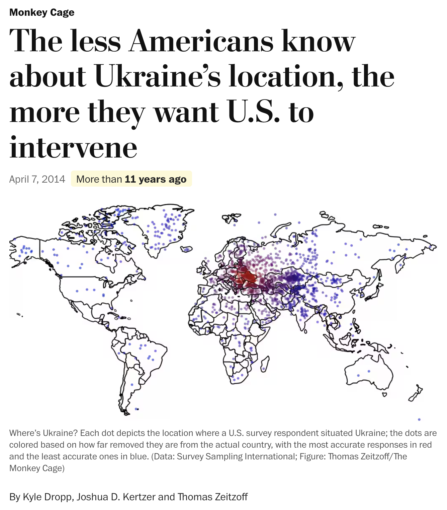
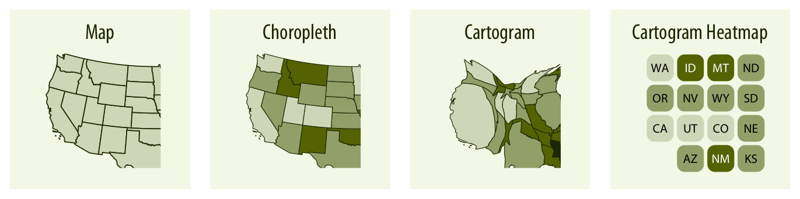
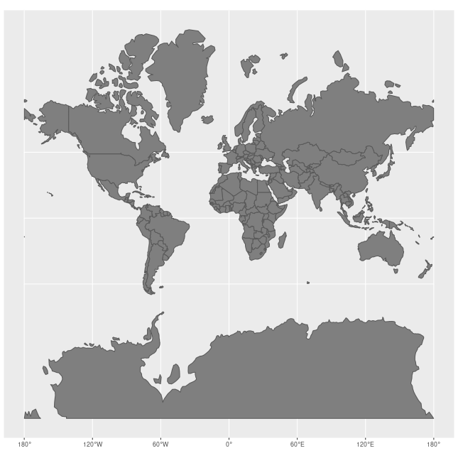
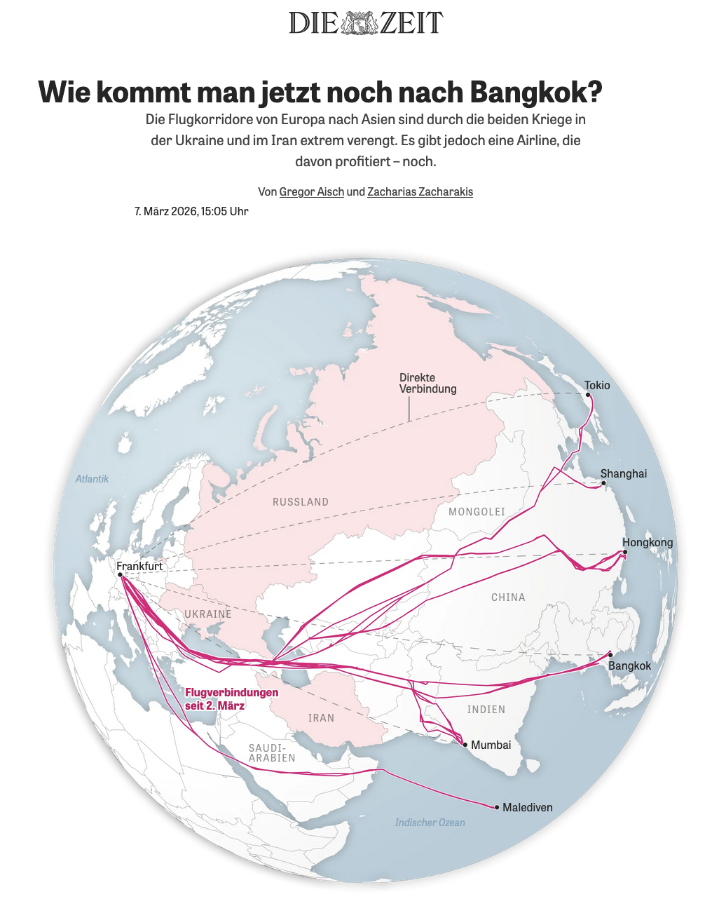
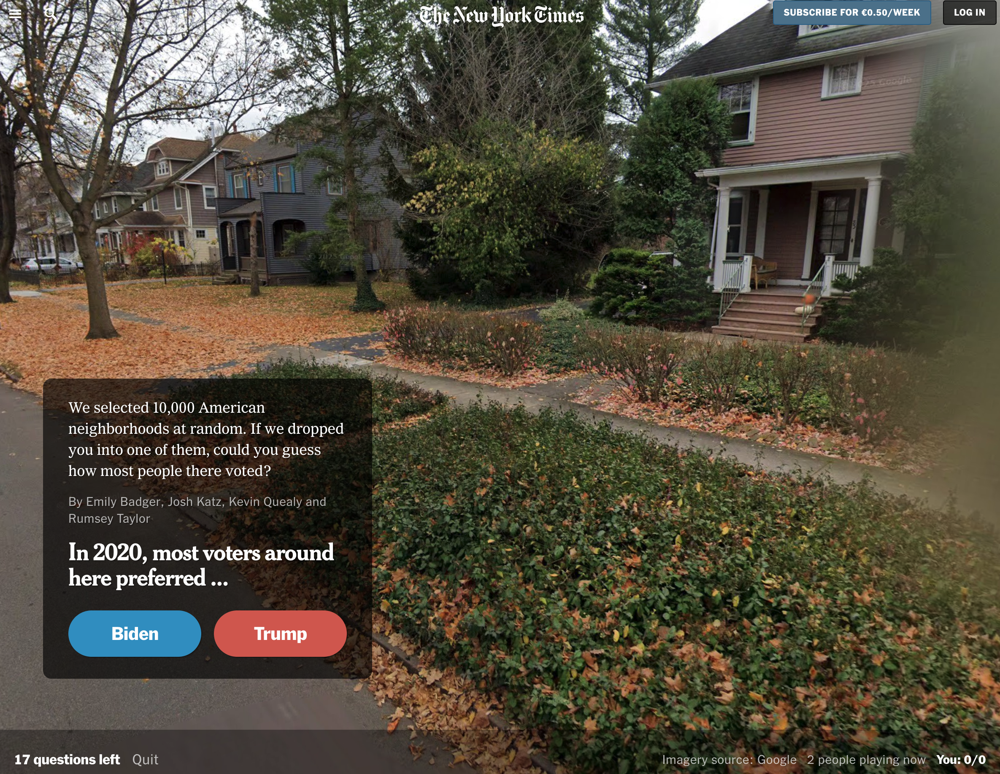
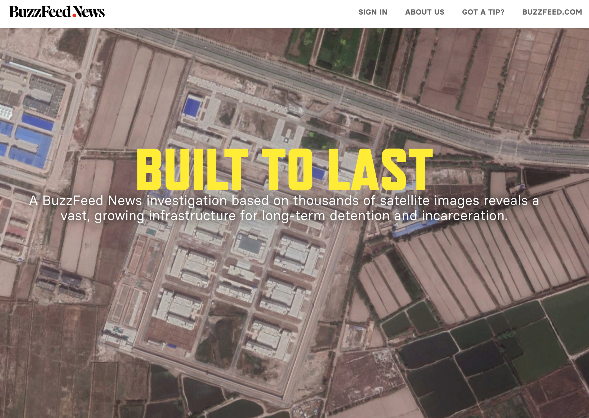

background-image: url(pics/star-trek-space.jpg)
background-size: contain
background-position: center
background-color: #000000

```{css, echo=FALSE}
@media print {
  .has-continuation {
    display: block !important;
  }
}
```

```{r setup, include=FALSE}
options(htmltools.dir.version = FALSE)
library(knitr)
opts_chunk$set(
  prompt = T, fig.align = "center",
  dpi = 300, cache = T,
  engine.opts = list(bash = "-l")
)
knit_hooks$set(
  prompt = function(before, options, envir) {
    options(
      prompt = if (options$engine %in% c('sh', 'bash')) '$ ' else 'R> ',
      continue = if (options$engine %in% c('sh', 'bash')) '$ ' else '+ '
    )
  })
library(tidyverse)
library(fontawesome)
```


# Space. The final frontier...


---
# Today

</br></br>

1. [Why space matters for journalism](#classics)

2. [Maps: dos and don'ts](#dosndonts)

3. [Beyond maps](#beyondmaps)


---
class: inverse, center, middle
name: spatial

# Why space matters for journalism
<html><div style='float:left'></div><hr color='#EB811B' size=1px style="width:1000px; margin:auto;"/></html>


---
# Why space matters generally

<br><br><br>

<div align="center" style="font-size:2em;">
<b>Everything is related to everything else,<br>but near things are more related than distant things.</b>
</div>

<br><br><br><br><br><br><br>

Tobler, Waldo. (1970). A Computer Movie Simulating Urban Growth in the Detroit Region. *Economic Geography* 46:234-240. https://doi.org/10.2307/143141


---
# Why space matters for journalism

<br><br><br>

<div align="center" style="font-size:2em;">
<b>The "where" of a story is central to journalism.</b>
</div>

<br><br><br><br><br><br><br>

Gomes, A., Brito, E., Morais, L. A., & Ferreira, N. (2025). How Do Data Journalists Design Maps to Tell Stories? *IEEE Transactions on Visualization and Computer Graphics.*

N. Usher. News cartography and epistemic authority in the era of big data: Journalists as map-makers, map-users, and map-subjects. *New Media & Society*, 22(2):247–263, 2020.

---
# 1854 Broad Street cholera outbreak

.pull-left[
<div align="center">
<br>

</div>
]

.pull-right[
- One of the most famous data viusalizations of all times: [John Snow](https://en.wikipedia.org/wiki/John_Snow)'s cholera case map.
- The [Broad Street cholera outbreak](https://en.wikipedia.org/wiki/1854_Broad_Street_cholera_outbreak) in in Soho, London in 1854 was studied by physician John Snow to study its causes (rival hypotheses: germ-contaminated water vs. airborne transmission).
- The germ theory was not established at this point but the map helped highlight how cases clustered around a contaminated pump (which was by far not the only source of contaminated water though).
- Fun fact: this is what doing good data viz gives you:

<div align="center">

</div>
]


---
# Mapping political outcomes

<div align="center">

</div>


---
# Mapping political outcomes

<div align="center">

</div>

`Source` [ZEIT Online](https://www.zeit.de/politik/ausland/2024-07/europawahl-2024-ergebnisse-gemeinden-laender-karte?freebie=220fa61c)


---
# Unterstanding international affairs

<div align="center">

</div>

`Source` [The Economist](https://www.economist.com/interactive/middle-east-and-africa/2026/03/06/the-iran-war-has-entered-a-new-phase)

---
# Unterstanding international affairs

<div align="center">
<video width="900" autoplay muted loop>
  <source src="pics/zeit-strait-hormus.mp4" type="video/mp4">
</video>
</div>

`Source` [Die Zeit](https://www.zeit.de/wirtschaft/2026-03/strasse-von-hormus-schifffahrt-oeltanker-frachter-iran?freebie=640aed06)

---
# Educating geographically illiterate audiences

<div align="center">

</div>

`Source` [Washington Post/Monkey Cage](https://www.washingtonpost.com/news/monkey-cage/wp/2014/04/07/the-less-americans-know-about-ukraines-location-the-more-they-want-u-s-to-intervene/); see also [Good Authority](https://goodauthority.org/news/finding-ukraine-on-a-map-revisited/).


---
# The design space of journalistic maps

<div align="center">

<br>
<code>Source</code> <a href="https://arxiv.org/abs/2508.10903">Gomes et al. (2025) "How do Data Journalists Design Maps to Tell Stories?"</a>
</div>

<div align="center">
<br>

<br>
<code>Source</code> <a href="https://clauswilke.com/dataviz/geospatial-data.html">Wilke, Fundamentals of Data Visualization</a>
</div>


---
class: inverse, center, middle
name: dosndonts

# Maps: Dos and don'ts
<html><div style='float:left'></div><hr color='#EB811B' size=1px style="width:1000px; margin:auto;"/></html>

---
# Fox News 2009

<div align="center">

<a href="https://www.huffpost.com/entry/fox-news-cant-find-egypt-map_n_816540" style="font-size:0.8em;">Source</a>
</div>

---
# WSJ 2012

<div align="center">

<a href="https://www.vox.com/2015/2/18/8056325/bad-maps" style="font-size:0.8em;">Source</a>
</div>

.center[
<small>Fox News. Alabama and Mississippi switched on a U.S. map.</small>
]


---
# Maps are beautiful ...

<div align="center">

</div>

.center[
<small>2019 US Midterm Election results; source: nytimes.com</small>
]


---
# ... but sometimes misleading

<div align="center">
<br>
 &emsp;

</div>

##  Don't confuse area size with actual data of interest

Large geographic areas attract attention regardless of their data values. Consider cartograms, hex tile maps, or dot density maps to counteract this.</small>


---
# Consider if a map is the right choice

<div align="center">
 &emsp;

</div>

## Maps help highlight geographical patterns, but is that your story?
Also discussed [here](https://statmodeling.stat.columbia.edu/2014/04/10/small-multiples-lineplots-maps-ok-always-yes-case/). The small multiple plot on the right does a much better job at showing the trends over time and comparing across countries, while the map on the left is more visually striking but less informative. The map also exaggerates the differences between countries due to the varying sizes of the areas.

---
# Consider if a map is the right choice

<div align="center">
 &emsp;

</div>

## Maps help highlight geographical patterns, but is that your story?
Also discussed [here](https://statmodeling.stat.columbia.edu/2014/04/10/small-multiples-lineplots-maps-ok-always-yes-case/). The small multiple plot on the right does a much better job at showing the trends over time and comparing across countries, while the map on the left is more visually striking but less informative. The map also exaggerates the differences between countries due to the varying sizes of the areas. A *cartogram* is almost never the right choice.


---
# Cartogram heatmaps can help (or confuse?)

<div align="center">
<br>


</div>


---
# Why not try small map multiples?

.pull-left[
<div align="center">
<br>

</div>
]


.pull-right[
<div align="center">
<br>

</div>
]


---
# Use color scales wisely

.pull-left[
## Three fundamental use cases for color in data visualizations:
  1. We can use color to **distinguish groups** of data from each other;
  2. We can use color to **represent data values**; and 
  3. We can use color to **highlight**.
  
Use [ColorBrewer](https://colorbrewer2.org/) to choose palettes.
]

.pull-right[
<div align="center">

 &emsp;


</div>
]


---
# Normalize your data

<div align="center">
<br>

</div>

<br>

## Mapping raw counts in choropleths can be misleading

Absolute counts can be misleading - large units/states dominate (left plot). Instead, normalize using meaningful baselines, such as per capita rates (right plot). If your story is indead about area size, that is probably not necessary. [Source.](https://handsondataviz.org/normalize-choropleth.html)


---
# Keep things simple

<div align="center">

</div>

## Don't overload your map with too many variables

Minard's famous [map of Napoleon's march on Russia in 1812](https://commons.wikimedia.org/wiki/File:Minard.png) has been regarded a masterpiece of data visualization. It combines multiple variables (geography, time, temperature, and troop size) in a clear and concise way. On the other hand, it's clearly **overloaded**, and one might ask if the same story could not have been told with several plots that are not as busy.


---
# Don't forget about your projection

.pull-left[
## The issue

The Earth is a sphere, but maps are flat. The choice of projection can affect how readers perceive the data and the story you want to tell.

On a Mercator map, Greenland appears the same size as Africa — but Africa is actually 14× larger. Try [thetruesize.com](https://thetruesize.com). Use equal-area projections (e.g., Robinson, Equal Earth) for world maps showing data.

<div align="center">

</div>
<code>Source</code> <a href="https://clauswilke.com/dataviz/geospatial-data.html">Wilke, Fundamentals of Data Visualization</a>
]

.pull-right-center[
<div align="center">

</div>

`Source` [Wikipedia](https://en.wikipedia.org/wiki/Mercator_projection#/media/File:Worlds_animate.gif)
]


---
# Don't forget about your projection

.pull-left[
## The issue

The Earth is a sphere, but maps are flat. The choice of projection can affect how readers perceive the data and the story you want to tell.

On a Mercator map, Greenland appears the same size as Africa — but Africa is actually 14× larger. Try [thetruesize.com](https://thetruesize.com). Use equal-area projections (e.g., Robinson, Equal Earth) for world maps showing data.

<div align="center">

</div>
<code>Source</code> <a href="https://clauswilke.com/dataviz/geospatial-data.html">Wilke, Fundamentals of Data Visualization</a>
]

.pull-right-center[
<div align="center">

</div>

`Source` [DIE ZEIT](https://www.zeit.de/wirtschaft/2026-03/lufthansa-europa-asien-nahostkrieg-flugverkehr?freebie=8bcf7aa3)
]


---
class: inverse, center, middle
name: beyond maps

# Beyond maps
<html><div style='float:left'></div><hr color='#EB811B' size=1px style="width:1000px; margin:auto;"/></html>


---
class: exercise
# Discussion

## Discuss
<br>
1. **Beyond the map:** Geospatial data is often treated as input for maps — 
   but what other analytical uses does it enable? Think of examples from 
   journalism or your own work.
   
2. **Spatial thinking as a method:** When does location *explain* something, 
   and when is it just context? How do you know when a spatial analysis 
   adds real insight vs. visual appeal?
   
3. **Access and limits:** Where does geospatial data come from, and who controls it? What are the ethical and practical constraints journalists face when working with it?


---
class: center

# Streetmap data

<div align="center">

</div>

`Source` [New York Times](https://www.nytimes.com/interactive/2021/upshot/trump-biden-geography-quiz.html)


---
class: center

# Satellite data

<div align="center">

</div>

`Source` [Buzzfeed](https://www.buzzfeednews.com/article/meghara/china-new-internment-camps-xinjiang-uighurs-muslims)


---
# Geospatial data beyond maps

## Location as a join key
Link datasets that share no common ID but share space — e.g., match industrial 
sites to asthma hospitalization records by proximity.

##  Distance and proximity as a variable
Not "where is X?" but "how far is X from Y, and does that distance predict 
something?" — access to schools, pollution exposure, ...

## Satellite and remote sensing data as a source
Count ships in a port, measure deforestation, detect construction in sanctioned 
countries. The imagery is evidence.

## Geocoding as a method for record linkage
Convert messy address data into coordinates to deduplicate records or match 
across datasets that otherwise can't be joined.


> **Coordinates are a universal join key** — they connect datasets that have 
nothing else in common. That's the analytical superpower, not (just) the map.


