```{css, echo=FALSE}
@media print {
  .has-continuation {
    display: block !important;
  }
}
```

```{r setup, include=FALSE}
options(htmltools.dir.version = FALSE)
library(knitr)
opts_chunk$set(
  prompt = T, fig.align = "center",
  dpi = 300, cache = T,
  engine.opts = list(bash = "-l")
)
knit_hooks$set(
  prompt = function(before, options, envir) {
    options(
      prompt = if (options$engine %in% c('sh', 'bash')) '$ ' else 'R> ',
      continue = if (options$engine %in% c('sh', 'bash')) '$ ' else '+ '
    )
  })
library(tidyverse)
library(fontawesome)
```


# Good writing


.pull-left[
<br><br><br><br><br>
<div align="center" class = "font100">
<b>You are not being trained as journalists.<br><br>But if you analyze data, you will have to write, speak, or present about data.<br><br>Today is about the craft of doing that well.</b>
</div>
]

.pull-right[
<br><br><br>
<div align="center">

</div>
]


---
# Today

</br></br>

1. [What makes a data story?](#whatisstorytelling)

2. [Five lessons for writing with data](#lessons)

3. [Ten bits of 1-minute advice](#oneminuteadvice)


<br>

.font90[

]


---
class: inverse, center, middle
name: whatisstorytelling

# What makes a data story?
<html><div style='float:left'></div><hr color='#EB811B' size=1px style="width:1000px; margin:auto;"/></html>


---
# Matei and Hunter, 2021

<div align="center">
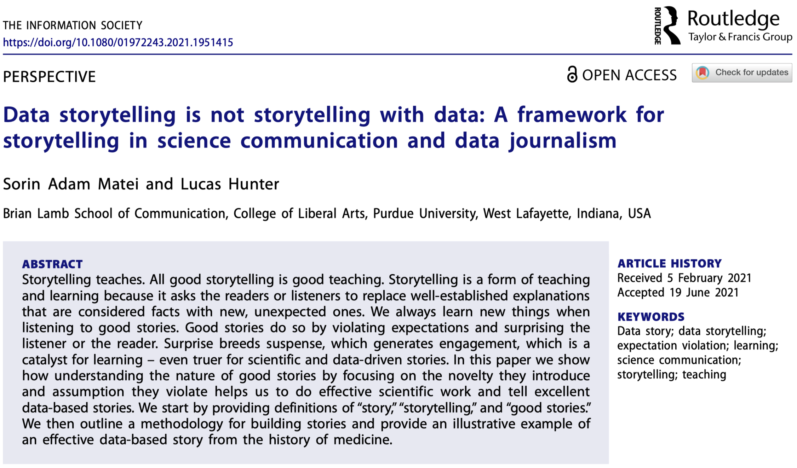
</div>


---
class: exercise
# Discussion

## In pairs, discuss the following quotes from Matei and Hunter (2021):

.pull-left[

### When a story is good

> A story is good because it satisfies a necessary and sufficient conditions; a good story always connects a cause to an effect (Schank 1991). Something leads to something else. Further, it is necessary the cause be unexpected. A good story neither states the obvious nor uses common sense as a universal yardstick (Dahlstrom 2014).

### The role of surprise

> The best stories employ surprise because surprise begets questions, which beget interest, which begets personal engagement, which leads to learning. All stories that use surprise work well, regardless of context or if they use numbers or not.

]

.pull-right[

### On scientific storytelling

> Scientific storytelling, in turn, has a natural advantage over conventional storytelling because it consistently provides new, unexpected explanations. (...) By the nature of their practice, scientists can also be excellent storytellers. In fact, they are taught to think like storytellers.

### On the role of novel explanations

> When relying on data to make their point, stories which use a new theoretical model (one that better fits the facts while violating previous theories) have a higher chance to capture public attention. Thus, it is the job of the professional communicator, especially data scientists or journalists, to seek explanations which violate assumptions and known theories in a justified manner.

]


---
# Scientific vs. journalistic writing

.pull-left[
Scientific and journalistic writing are **two different genres**. They differ in their goals and audience, which has implications for the structure and style of the writing. 

## Compare
 
- **Language:** Scientific jargon vs. plain language
- **Structure:** Archetypical IMRD (Introduction, Methods, Results, Discussion) vs. the inverted pyramid (lede first, details later)
- **Title:** Describe the topic vs. Deliver the finding (or create suspense)
]

.pull-right[
## A mix of rather unexciting research article headlines
<div align="center">
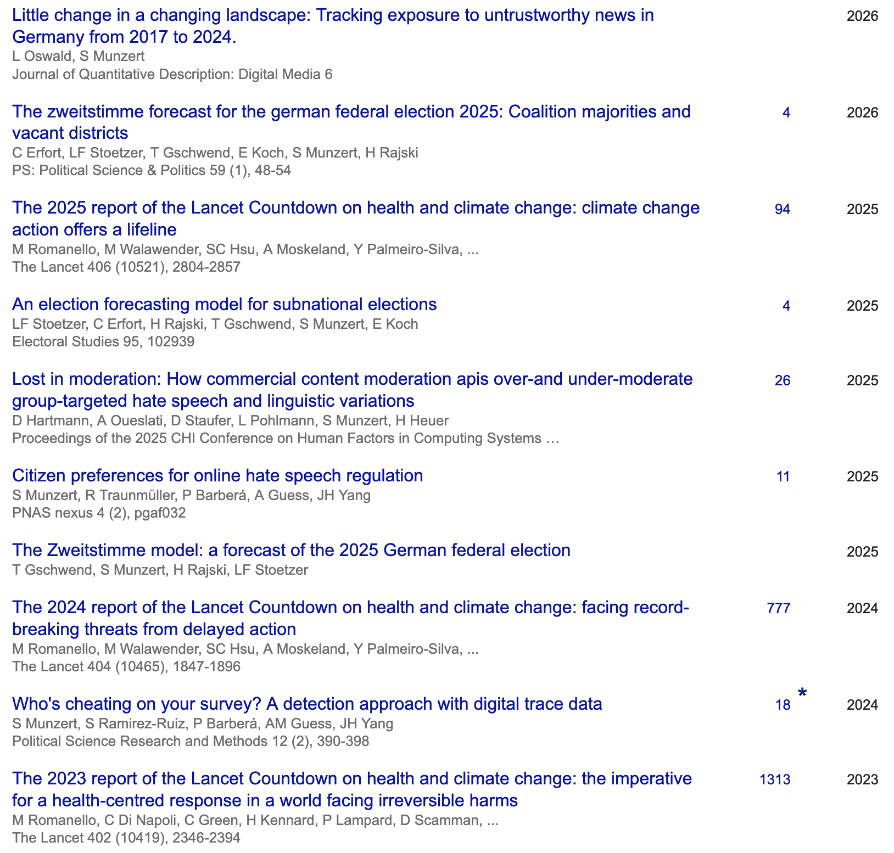
</div>
]


---
# Science or journalism?

<br>

```{r embed-swipe-data, echo=FALSE, results='asis', message=FALSE}
# Bake app/headlines.csv into the HTML at knit time, so the slide deck is
# self-contained (works from file:// and githack without a fetch).
.sg_csv <- "app/headlines.csv"
if (file.exists(.sg_csv)) {
  # Read as raw bytes, then coerce to valid UTF-8. This survives files that
  # were saved in Mac OS Roman / Windows-1252 / Latin-1 by mistake.
  .sg_raw  <- readBin(.sg_csv, what = "raw", n = file.info(.sg_csv)$size)
  .sg_text <- rawToChar(.sg_raw)
  .sg_text <- iconv(.sg_text, from = "UTF-8", to = "UTF-8", sub = "?")
  if (is.na(.sg_text)) {
    # Byte-string wasn't UTF-8 at all — assume legacy 1-byte encoding.
    .sg_text <- iconv(rawToChar(.sg_raw), from = "latin1", to = "UTF-8", sub = "?")
  }
  .sg_df <- utils::read.csv(text = .sg_text, stringsAsFactors = FALSE,
                            na.strings = character())
  .sg_df[is.na(.sg_df)] <- ""
  .sg_json <- jsonlite::toJSON(.sg_df, dataframe = "rows", auto_unbox = TRUE)
  # Prevent premature </script> termination if any field happens to contain it.
  .sg_json <- gsub("</", "<\\/", .sg_json, fixed = TRUE)
  cat('<script>window.SG_DATA = ', .sg_json, ';</script>', sep = "")
} else {
  cat('<script>window.SG_DATA = [];</script>')
}
```

<style>
@import url('https://fonts.googleapis.com/css2?family=Playfair+Display:wght@800;900&display=swap');
#sg-text {
  font-family: 'Playfair Display', Georgia, 'Times New Roman', serif;
  font-weight: 900;
  font-size: 26px;
  line-height: 1.2;
  letter-spacing: -0.01em;
  color: #111;
}
</style>

<div id="sg" style="max-width:780px; margin:10px auto; font-family:inherit;">
  <div id="sg-score" style="text-align:right; color:#888; font-size:14px;">Score: 0 / 0</div>
  <div id="sg-card" style="background:#fff; border:1px solid #ddd; border-radius:12px;
       padding:20px 28px; min-height:90px; box-shadow:0 4px 14px rgba(0,0,0,.08);
       font-size:22px; line-height:1.4; margin-top:6px;
       display:flex; align-items:center; justify-content:center; text-align:center;">
    <span id="sg-text">Loading…</span>
  </div>
  <div style="display:flex; justify-content:center; gap:18px; margin-top:12px;">
    <button onclick="sgGuess('journalism')"
      style="padding:12px 28px; border:none; border-radius:8px;
             background:#C2001A; color:#fff; cursor:pointer; font-size:16px;">
      📰 Journalism
    </button>
    <button onclick="sgGuess('science')"
      style="padding:12px 28px; border:none; border-radius:8px;
             background:#1D375B; color:#fff; cursor:pointer; font-size:16px;">
      🔬 Science
    </button>
  </div>
  <div id="sg-feedback" style="min-height:30px; margin-top:14px; text-align:center; font-size:18px;"></div>
</div>

<script>
(function () {
  const $ = id => document.getElementById(id);

  function shuffle(a) {
    for (let i = a.length - 1; i > 0; i--) {
      const j = Math.floor(Math.random() * (i + 1));
      [a[i], a[j]] = [a[j], a[i]];
    }
    return a;
  }

  let items = [], i = 0, right = 0, total = 0, locked = false;

  function render() {
    if (i >= items.length) {
      $('sg-text').innerHTML =
        '<b>Done!</b><br><span style="font-size:18px; color:#666;">Final score: ' +
        right + ' / ' + total + '</span>';
      $('sg-feedback').innerHTML =
        '<button onclick="sgRestart()" style="padding:6px 14px; font-size:14px;">Restart</button>';
      return;
    }
    $('sg-text').textContent = items[i].t;
    $('sg-feedback').innerHTML = '';
    locked = false;
  }

  window.sgGuess = function (k) {
    if (locked || i >= items.length) return;
    locked = true; total++;
    const ok = k === items[i].k; if (ok) right++;
    $('sg-score').textContent = 'Score: ' + right + ' / ' + total;
    const srcHtml = items[i].url
      ? '<a href="' + items[i].url + '" target="_blank" rel="noopener">' + items[i].s + '</a>'
      : items[i].s;
    $('sg-feedback').innerHTML =
      (ok ? '✅ Correct' : '❌ Wrong') +
      ' — <em>' + items[i].k + '</em> <span style="color:#888;">(' + srcHtml + ')</span>' +
      ' <button onclick="sgNext()" style="margin-left:12px; padding:6px 14px; font-size:14px;">Next →</button>';
  };

  window.sgNext = function () { i++; render(); };

  window.sgRestart = function () {
    i = 0; right = 0; total = 0;
    shuffle(items);
    $('sg-score').textContent = 'Score: 0 / 0';
    render();
  };

  // Data was baked in at knit time from app/headlines.csv — see the R chunk above.
  const data = (window.SG_DATA || []).map(d => ({
    t: (d.text || '').toString().trim(),
    k: (d.kind || '').toString().toLowerCase().trim(),
    s: (d.source || '').toString().trim(),
    url: (d.url || '').toString().trim()
  })).filter(it => it.t && (it.k === 'science' || it.k === 'journalism'));

  if (!data.length) {
    $('sg-text').innerHTML =
      '<span style="color:#C2001A;">No headline data embedded.</span><br>' +
      '<span style="font-size:14px; color:#888;">' +
      'Check that <code>app/headlines.csv</code> exists with columns ' +
      '<code>text</code>, <code>kind</code>, then re-knit.</span>';
    return;
  }

  items = data;
  shuffle(items);
  render();
})();
</script>


---
# Common angles for data stories

<div align="center">

</div>

`Source` [Paul Bradshaw, Online Journalism Blog](https://onlinejournalismblog.com/2020/08/11/here-are-the-7-types-of-stories-most-often-found-in-data/)

---
# &nbsp;

<div align="center">
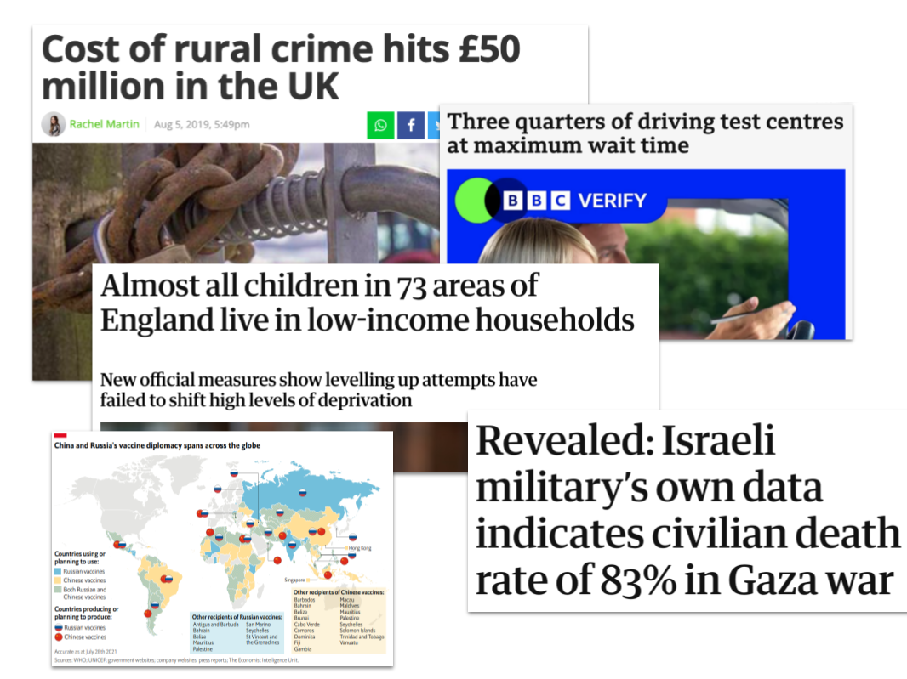
</div>

---
# Scale: How big is an issue

<div align="center">

</div>


---
# &nbsp;

<div align="center">
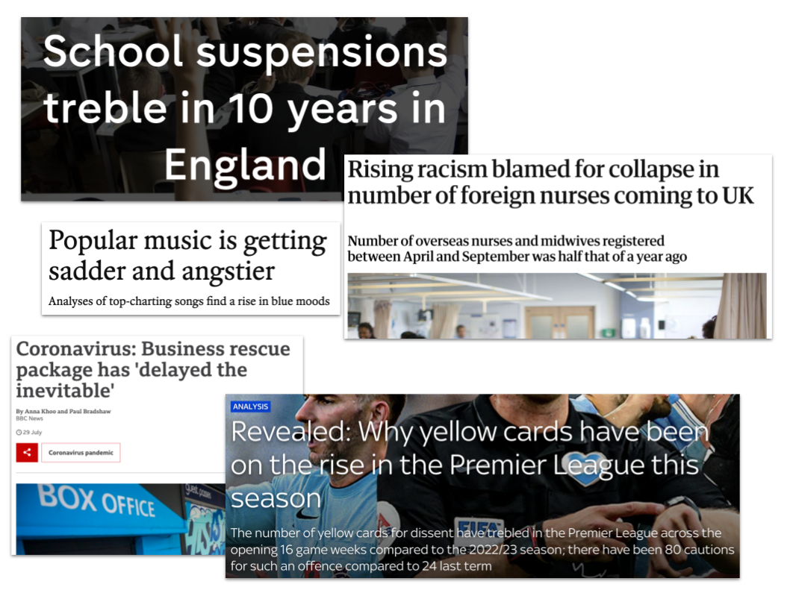
</div>

---
# Change: Things getting better/up or worse/down

<div align="center">

</div>

---
# &nbsp;

<div align="center">
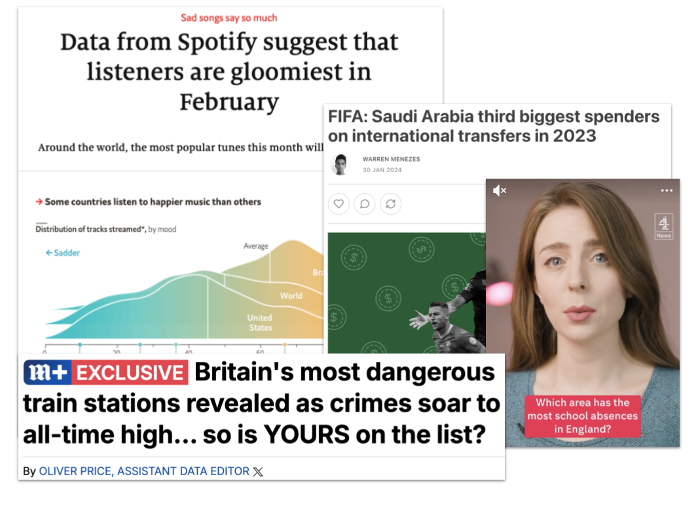
</div>

---
# Ranking: The best/worst/outliers

<div align="center">

</div>

---
# &nbsp;

<div align="center">
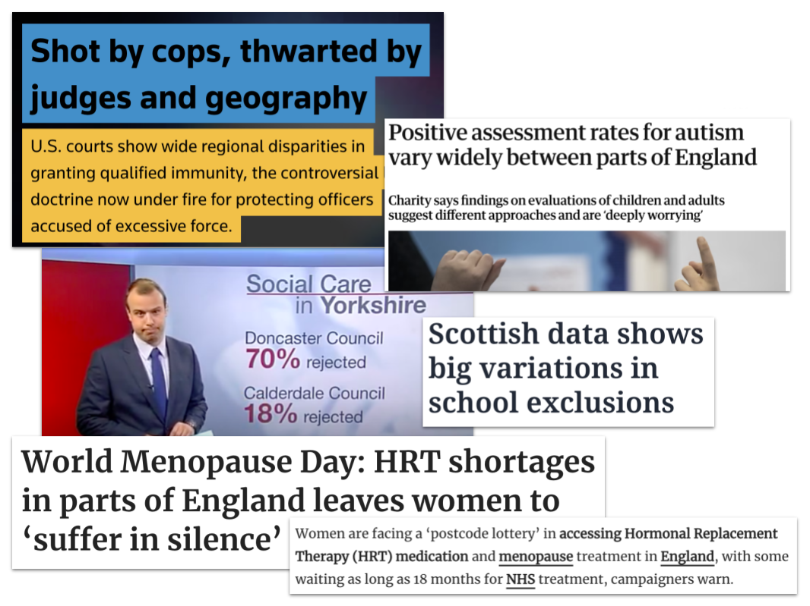
</div>

---
# Variation: Things are different across space/subgroups

<div align="center">

</div>

---
# &nbsp;

<div align="center">
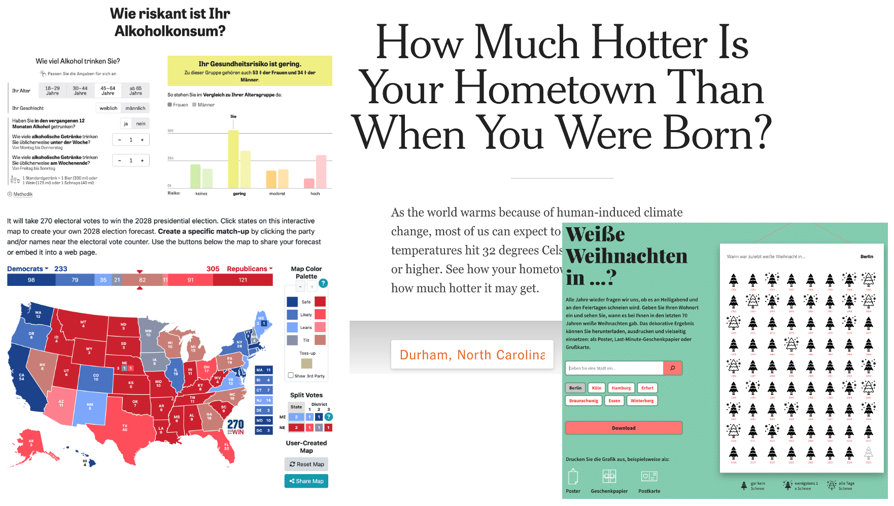
</div>

---
# Exploration: Tools, simulators, interactivity, personalization

<div align="center">

</div>

---
# &nbsp;

<div align="center">
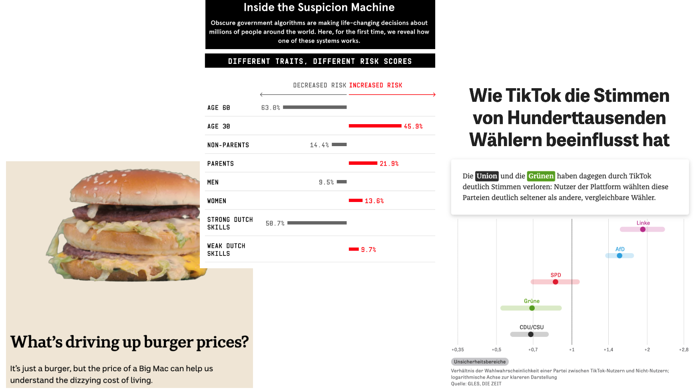
</div>

---
# Relationships: How things are (causally) connected (and why)

<div align="center">

</div>

---
# &nbsp;

<div align="center">
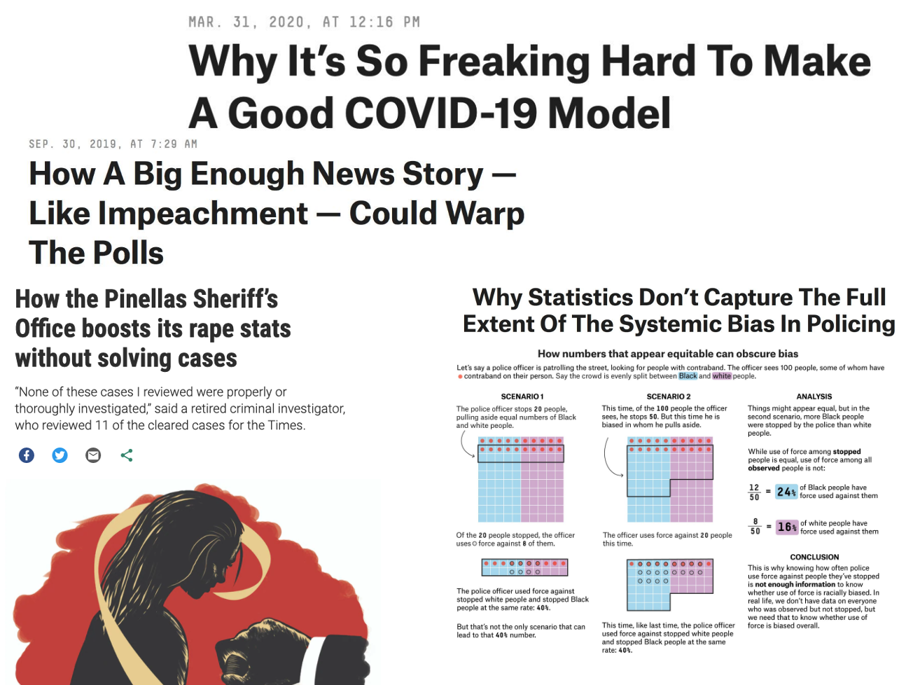
</div>

---
# Data: Bad data, good data, hey we got the data stories

<div align="center">

</div>


---
class: inverse, center, middle
name: lessons

# Five lessons for writing with data
<html><div style='float:left'></div><hr color='#EB811B' size=1px style="width:1000px; margin:auto;"/></html>


---
# Lesson 1: Start from the one-sentence claim

.pull-left[
## The lesson

- **Before you write a single paragraph, write your claim in one sentence.** If you can't, you don't yet know what you're writing about.
- The one-sentence claim becomes your **organizing principle** — the headline, the lede etc. all point at it.
- If your claim changes halfway through the draft, fine — but rewrite the opening to match.

## The headline

- In the end, your claim can be the headline. 
- In any case, **a headline is a claim, not a topic.** "Housing in Berlin" is not a headline. "Berlin rents rose faster last year than in any year since 1991" is.
- Good test: can your reader tell, from the headline alone, what the story is? If not, rewrite.
]

.pull-right[

## A simple template

*"[In population / context], [what happened / is happening], [by how much / compared to what]."*

## Examples

| ❌ Topic headline | ✅ Finding headline |
|---|---|
| "A look at EU antibiotic use" | "Europe is winning the antibiotic battle — unevenly" |
| "Gender in German startups" | "German startups led by women raise half as much" |
| "Housing in Berlin" | "Berlin's rents rose 130% in a decade" |

The headline is probably the last thing that you write — but it should be the first thing you think about.

]


---
class: exercise
# Exercise: Write the claim

## You have this finding:

> A new analysis of Germany's startup ecosystem, based on data from the Federal Statistical Office and Crunchbase covering roughly 500 venture-backed companies founded between 2019 and 2024, sheds light on how founder demographics may relate to early-stage fundraising outcomes. The study, which considers firms across sectors including fintech, climate tech, and enterprise software, examines a range of variables including founding team size, geographic location, and prior work experience. Among its findings, the analysis indicates that, all else being roughly equal, founders under the age of 30 tend to close their Series A rounds at valuations that translate to approximately €1.2 million less on average than their counterparts aged 30 and above — a gap that persists even after accounting for the fact that the two groups showed broadly comparable revenue growth trajectories in the twelve months leading up to the round. Industry observers have long debated whether age serves as a proxy for experience, network depth, or investor bias, and while this study does not resolve that question, the results arguably add a quantitative data point to an ongoing conversation.

## Task (3 minutes, individually)

Write the **one-sentence claim** you would put at the top of the article. Aim for:
- A verb that does work (not "examines", not "looks at")
- A specific number
- A comparison or a "but"

---
class: exercise
# Exercise: Rewrite these headlines

## Topic → Finding (5 minutes)

Rewrite each topic headline as a **finding headline**. You will need to invent plausible numbers — that's fine, it's an exercise in form.

<br>

1. *"A study of commuting patterns in German cities"*

2. *"An analysis of climate spending in the EU budget"*

3. *"Women in German politics"*

4. *"AI adoption in small businesses"*


---
# Lesson 2: Build  a solid structure — the inverted pyramid

.pull-left[
## The lesson

- **Most important thing first.** Less important after. Caveats come last.
- Readers drop off paragraph by paragraph. Write so that whenever they stop, they still got the point.


## The classic order

  1. **Lede** — the finding addressing the five Ws
  2. **Nut graf** — why it matters in a NUTshell
  3. **Evidence** — the key numbers
  4. **Context** — comparisons, history
  5. **Voices** — quotes, alternative views
  6. **Methods & caveats** — how we know

More freestyle narrative arcs work too — but only if you have a reason to use one.
]

.pull-right-center[

<div align="center">

</div>

<div align="center">
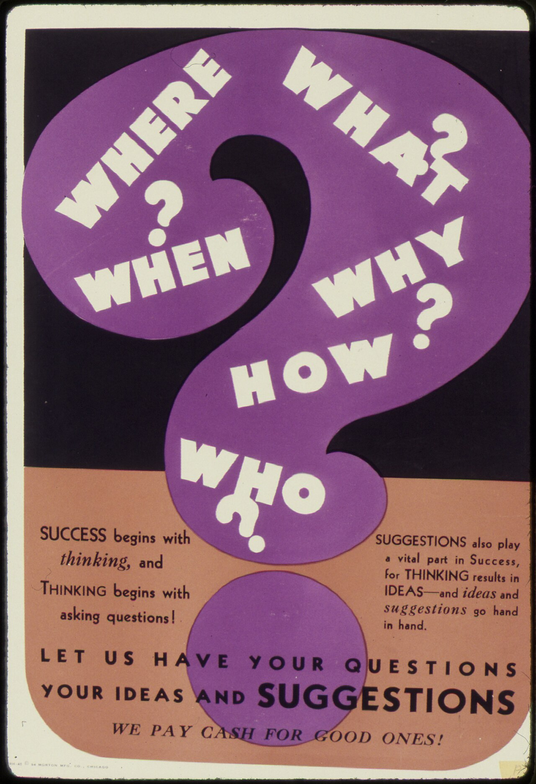
</div>

`Source` [Wikipedia](https://en.wikipedia.org/wiki/News_style)
]


---
class: exercise
# Exercise: Put the paragraphs in order

## Here are six paragraphs from a story — shuffled. Put them in inverted-pyramid order.

.font90[
**(a)** *"The study used anonymised tax records from 2015 to 2023, controlling for age, sector, and firm size. Its authors caution that cross-country comparisons remain difficult."*

**(b)** *"Germany's gender pay gap narrowed for the first time in a decade last year — and the driver was not what policymakers expected."*

**(c)** *"The shift was driven almost entirely by wage growth among women in the public sector, where new collective bargaining agreements raised base salaries by 11% on average."*

**(d)** *"'This is not a story about firms finally paying women fairly,' said Prof. Anna Weber of the DIW. 'It's a story about which sector women happen to be in.'"*

**(e)** *"The gap now stands at 15.7%, down from 18.3% in 2022 — the sharpest single-year drop since Germany began tracking the measure."*

**(f)** *"If the finding holds up, it suggests that private-sector pay practices have scarcely budged — and that the headline progress masks deeper stagnation."*
]


---
class: exercise
# Exercise: Put the paragraphs in order

## Here are six paragraphs from a story — shuffled. Put them in inverted-pyramid order.

.font90[
**(a)** *"The study used anonymised tax records from 2015 to 2023, controlling for age, sector, and firm size. Its authors caution that cross-country comparisons remain difficult."*

**(b)** *"Germany's gender pay gap narrowed for the first time in a decade last year — and the driver was not what policymakers expected."*

**(c)** *"The shift was driven almost entirely by wage growth among women in the public sector, where new collective bargaining agreements raised base salaries by 11% on average."*

**(d)** *"'This is not a story about firms finally paying women fairly,' said Prof. Anna Weber of the DIW. 'It's a story about which sector women happen to be in.'"*

**(e)** *"The gap now stands at 15.7%, down from 18.3% in 2022 — the sharpest single-year drop since Germany began tracking the measure."*

**(f)** *"If the finding holds up, it suggests that private-sector pay practices have scarcely budged — and that the headline progress masks deeper stagnation."*
]

**Good order:** b → f → e → c → d → a. *Do you agree?*


---
# Lesson 3: Write a strong lede

.pull-left[
## The lesson

- The **first sentence has one job**: make the reader stay for the second.
- Two structures work:
  (a) **direct lede** — state the finding.
  (b) **scene-setting lede** — start with a person or place, then pivot by paragraph 2.
- Both pieces need a **nut graf** — the paragraph that says *"this matters because…"* — within the first three paragraphs.
- What does *not* work: the **background lede** ("For years, researchers have debated..."). Readers leave.

## The litmus test
Cover your first paragraph. Can the reader still tell what the story claims? If yes, your lede buries the finding. This is (often) bad.
]

.pull-right[
## Good ledes: Examples


### Accountability

> "Doctors in New Jersey have received at least **$2.1 billion** from drug companies over the past decade, according to federal records — payments that critics say skew prescribing decisions toward the companies' own products."

### Puzzle in need of explanation

> "The United States is dying faster than it used to. After decades of gains, American life expectancy fell in **2015** — and it has barely recovered since."

### Personal

> "If you were born in Berlin-Mitte in 1990, you have watched your rent rise **more than 130%**. If you were born in Gelsenkirchen, it has barely moved."

]

---
class: exercise
# Exercise: Compare two ledes

## The story

A study finds that German medical students from rural backgrounds are 40% less likely to become doctors in rural areas than their urban peers — the opposite of long-standing policy assumptions.

<br>

.pull-left[
## Lede A
*"For decades, German medical policy has assumed that recruiting students from rural areas will improve doctor shortages in the countryside. A new analysis from the Robert Koch Institute, published this week in the journal Gesundheitswesen, examined records of 12,000 medical school graduates across 16 federal states between 2005 and 2020…"*
]

.pull-right[
## Lede B
*"Germany's rural doctor shortage has a surprising source: rural medical students. A new analysis of 12,000 graduates finds that students from rural backgrounds are 40% less likely to practise in the countryside than their urban classmates — overturning a central assumption of national health policy."*
]

<br>

**Discuss: Which lede do you find stronger? Why?** 


---
# Lesson 4: Make every number concrete

<br>

## The lesson

- **Raw numbers don't land — they need anchors.** "€2 billion" is abstract. "€2 billion — about double the yearly budget of the city of Potsdam" is concrete.
- Use comparisons: **per person**, **per day**, **as a share of**, **a multiplier of something familiar**.
- **One or two precise numbers per paragraph.** Round for prose, keep precision in tables.
- Avoid false precision: "4,273 died" sounds scientific but often isn't. "More than 4,000" is usually more honest.
- Never use a unit readers can't picture (hectares, petabytes, basis points) without translating.


---
class: exercise
# Exercise: Make the numbers concrete

## Rewrite each sentence to make the number land (5 minutes)

<br>

1. *"Germany spent €47.3 billion on defence in 2024."*

2. *"The model's classification accuracy was 83.2%."*

3. *"The study sampled 2,147 households."*

4. *"The company's carbon footprint was 1.4 million tonnes of CO₂."*

<br>

## Share one with the group

What **anchor** did you pick? (per capita? share of GDP? equivalent in cars, flights, trees?) Why that one?


---
# Lesson 5: Revise — cut hedging, jargon, filler

<br>

## The lesson

- Your first draft is not your final draft.
- Cut: *"it should be noted that"*, *"arguably"*, *"somewhat"*, *"a number of"*, *"in order to"*, *"at this point in time"*.
- Replace jargon with plain words: *utilize* → *use*; *methodology* → *method*; *incentivize* → *pay*.
- Shorten every sentence by 20%. Then do it again.
- **Read the draft aloud.** If you stumble, the reader will too.
- Be honest about uncertainty — but honestly, not evasively. *"We don't know"* is better than *"it remains to be seen"*.

## Simple rule

If you can delete a word without changing the meaning, delete it.


---
class: exercise
# Exercise: Edit this paragraph

## Cut it by at least 30%. Keep the meaning. (7 minutes)

.font90[
> "Drawing on administrative data from Destatis and the Federal Employment Agency covering roughly 45,000 small and medium-sized enterprises (SMEs) in rural districts between 2014 and 2022, this analysis finds evidence of what appears to be a notable association between the expansion of broadband internet access and hiring activity at the firm level. Specifically, a 10-percentage-point increase in household broadband coverage within a district is associated with an approximately 3.4 percent higher annual hiring rate among local SMEs, with the effect being somewhat more pronounced for firms with fewer than 50 employees. It should be noted that these findings are correlational in nature and do not necessarily establish a causal relationship, and a number of methodological caveats apply, particularly regarding unobserved regional heterogeneity."
]

## Compare with your neighbour

Whose cut was tighter? What did you each delete first? Any words you **kept** that your neighbour cut — and why?


---
class: exercise
# Exercise: Edit this paragraph

## Reduce the following paragraph to 2 sentences. Keep the key messages (7 minutes)

.font90[
> "Drawing on administrative data from Destatis and the Federal Employment Agency covering roughly 45,000 small and medium-sized enterprises (SMEs) in rural districts between 2014 and 2022, this analysis finds evidence of what appears to be a notable association between the expansion of broadband internet access and hiring activity at the firm level. Specifically, a 10-percentage-point increase in household broadband coverage within a district is associated with an approximately 3.4 percent higher annual hiring rate among local SMEs, with the effect being somewhat more pronounced for firms with fewer than 50 employees. It should be noted that these findings are correlational in nature and do not necessarily establish a causal relationship, and a number of methodological caveats apply, particularly regarding unobserved regional heterogeneity."
]

## Compare with your neighbour

Which version is more on point? What did you each delete first? Any words you **kept** that your neighbour cut — and why?

.font80[
*Sample answer: "New analysis of German federal data links rural broadband access to company hiring. The effect is large — but it may not last, and several caveats apply."*
]


---
# Your writing workflow

<br>

.pull-left[
## Before you write

1. **Find the claim** — one sentence.
2. Pick the **shape** — accountability, explanatory, personal.
3. Identify your strongest **number** and your best **comparison**.

## While you write

4. **Headline first and last.** It disciplines the draft.
5. **Lede second.** Lead with the point; pivot by paragraph 2.
6. **Inverted pyramid** unless you have a reason not to.
]

.pull-right[
## After you write

7. **Cut 20%.** Then cut 10% more.
8. **Read aloud.** Mark every stumble.
9. **Hand it to someone** who has not seen your data. Can they state your claim after reading the first paragraph?

<br>

> Writing about data is not a different skill from writing in general. It is writing in general — with the extra discipline of being exactly right about what the numbers show.
]


---
class: inverse, center, middle
name: oneminuteadvice

# Ten bits of 1-minute advice
<html><div style='float:left'></div><hr color='#EB811B' size=1px style="width:1000px; margin:auto;"/></html>


---
# 1. Small numbers

.pull-left[

<h2 style="display:flow-root;">To make a very small proportion more understandable, divide it into 1.</h2>

For instance, 0.0091 (or 0.9%) is the proportion of the U.S. population who die every year (about 3.1 out of 335m). 

Start from the raw ratio:

$$p = \frac{\text{deaths per year}}{\text{U.S. population}} = \frac{D}{N}$$

Inverting gives "1 in every":

$$\frac{1}{p} = \frac{N}{D}$$

Here, $\frac{1}{p} = \frac{1}{0.091}\approx 110$. So:

> 1 in 110 Americans dies each year.
]

.pull-right[

## Your turn

Turn the follwing into a *"1 in every ___"* statement.

1. About **0.014** of German adults hold a doctorate.

2. In 2023, about **2,800 people** died in road traffic in Germany. The population is **~84 million**.
]


---
# 2. Small numbers II

.pull-left[

<h2 style="display:flow-root;">For non-tiny proportions, prefer "X in 10" or "X in 100".</h2>

"1 in 110" is technical. **"X in 10"** and **"X in 100"** are cognitive landmarks:

- **X in 10** — a group readers can picture (a classroom, a family, a team).
- **X in 100** — the natural-frequency form of a percent. *"8 in 100"* and *"8%"* are mathematically identical, but readers reason more accurately with the first, especially about risk.

### Rule of thumb:

Match the denominator to the scale. For rare events, keep *"1 in N"*. For common ones, anchor to 10 or 100.

.font90[See [Gigerenzer et al. (2007), *Psychological Science in the Public Interest*](https://journals.sagepub.com/doi/10.1111/j.1539-6053.2008.00033.x).]
]

.pull-right[

## Your turn

Rewrite each number in the most intuitive form — and say why you chose that denominator:

1. **37%** of German households live in rented flats.

2. **12.7%** of working-age adults receive some form of state benefit.

3. The annual risk of dying on the road in Germany is about **1 in 30,000**.
]


---
# 3. Rounding

.pull-left[

<h2 style="display:flow-root;">Unless your numbers are very small, decimal points rarely matter.</h2>

> *"I'm a big fan of rounding."*
> — Sarah Cohen, [*Numbers in the Newsroom*](https://businessjournalism.org/2012/03/sarah-cohen-on-taming-digits/)

"About 37%" is almost always better than "37.24%". Trailing digits imply a precision your data usually can't support — a point [Andrew Gelman](https://statmodeling.stat.columbia.edu/2025/03/07/the-answer-to-the-how-many-significant-digits-problem-is-the-same-as-the-answer-to-the-what-to-graph-problem-the-click-through-solution/) makes repeatedly on his blog.

### Rule of thumb:

If the next decimal doesn't change your point, drop it.
]

.pull-right[
## Good ([Pew Research Center](https://www.pewresearch.org/short-reads/2025/09/03/favorable-views-of-supreme-court-remain-near-historic-low/))

<div align="center">
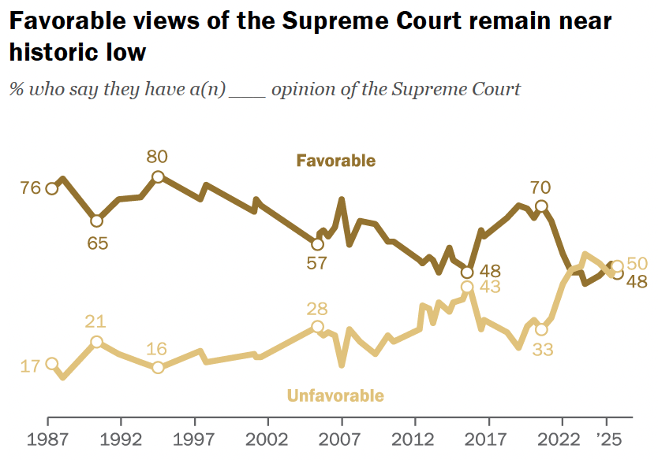
</div>

## Bad ([NYT](https://www.nytimes.com/interactive/2025/10/06/upshot/us-international-student-travel.html), discussed by [Kaiser Fung](https://www.junkcharts.com/the-story-on-international-students-coming-to-the-u-s/))

<div align="center">
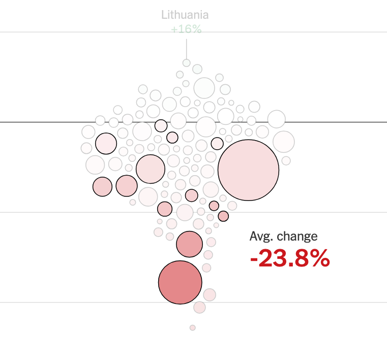
</div>
]


---
# 4. The 12-digit rule

.pull-left[

<h2 style="display:flow-root;">No more than 12 digits per paragraph — and dates count.</h2>

*"2012"* is 4 digits. *"Between 2011 and 2012, Germany spent €47.3 billion on climate subsidies…"* is already **4 + 4 + 3 = 11 digits**. You're nearly out.

Readers stop absorbing numbers long before you stop writing them. Put too many numbers into text, and you're writing a table disguised as a paragraph.

See also [Reynolds Center — "Taming Digits"](https://businessjournalism.org/2012/03/sarah-cohen-on-taming-digits/).
]

.pull-right[

## Your turn — count the digits

> *"Between **2015** and **2023**, Germany's primary energy consumption fell from **13,293** petajoules to **10,736** petajoules, while the share of renewables rose from **14.9%** to **22.1%** and CO₂ emissions dropped by **187** million tonnes."*


1. How many digits?
2. What would you cut to get under 12?
3. What moves to a chart?
]


---
# 5. Avoid "X times less"

.pull-left[

<h2 style="display:flow-root;">"X times less" is mathematically ambiguous.</h2>

Does it mean **one-third** the original? A 300% reduction (impossible)? Most readers don't know — and neither does half the newsroom.

**Use instead:**
- Fractions: *"one-third as much"*, *"half as many"*
- Percentages: *"a 67% decrease"*

Applies to *"times smaller"*, *"times fewer"*, *"times lower"* — all the same trap.
]

.pull-right[

## Your turn — rewrite

Rewrite each sentence without *"times less"* or its cousins:

<br>

1. "Women in the sample were paid **1.6 times less** than men."

2. "Public-sector salaries grew **three times slower** than inflation."

3. "Rural broadband rollout has been **four times fewer** projects per capita than the urban one."
]


---
# 6. Percent ≠ percentage points

.pull-left[

<h2 style="display:flow-root;">A rate change has two numbers. Say which you mean.</h2>

A tax rate rising from **4% to 5%** is:
- **+1 percentage point** (absolute)
- **+25%** (relative)

Both are correct. They describe very different stories.

> **Rule:** every time you report a change in a rate, say which one you mean — explicitly.

.font90[Politicians and press releases exploit this ambiguity. Don't. See [Denise-Marie Ordway's explainer](https://journalistsresource.org/home/percent-change-math-for-journalists/) and this [interactive explainer](https://journalistsresource.org/media/infographic-percent-percentage-point/).]
]

.pull-right[
## Your turn

Come up with two headlines with different narratives based on the following data:

- Meanville is an average town. Its latest overall budget is $50 million, up from $25 million the year before.
- Last year's education budget was $2 million. After the windfall, it shot up to $3 million.
- Education spending as proportion of the budget was 8% last year.
]


---
# 7. Every number needs a denominator

.pull-left[

<h2 style="display:flow-root;">Totals are meaningless without context.</h2>

Example questions to ask before publishing any number:

- **Out of how many people?** (per capita)
- **Over how long?** (per year, per decade)
- **Compared to where?** (vs. national average, vs. last year)

The denominator is the comparison that turns a number into a story.

> If you can't put a denominator on it, ask whether it's a number worth reporting at all.
]

.pull-right[

## Your turn — add the denominators

For each bare number, write the denominator sentence you'd want before publishing:

1. "Berlin police made **5,183 drug-related arrests** last year."

2. "Fraunhofer institutes filed **512 patents** in 2024."

3. "**37,000 refugees** arrived in Lower Saxony since 2022."
]


---
# 8. Link your sources

.pull-left[

<h2 style="display:flow-root;">In digital media, your footnotes are hyperlinks. Use them.</h2>

A print reporter writes *"according to a 2023 OECD report"*. On the web, you can do better:

- Link **directly to the dataset** — not the press release.
- Link **the paper**, not the institution page.
- Link **the filing, the regulation, the minutes** — the primary document.

Readers who don't care won't click; readers who do will trust you more. See, e.g.,  [The Pudding](https://pudding.cool/) for how dense linking reads on the page.
]

.pull-right-center[

<div align="center">
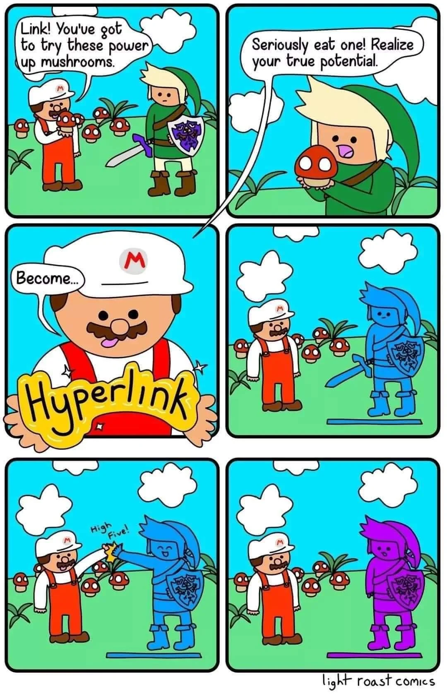
</div>

`Source` [r/PeterExplainsTheJoke](https://www.reddit.com/r/PeterExplainsTheJoke/comments/1h1w9np/peter_why_does_link_change_colors/).
]


---
# 9. Put the methodology at the end

.pull-left[

<h2 style="display:flow-root;">Lead with the finding; park the method at the bottom.</h2>

The top of your piece is for claims and stakes. The bottom is where you show your work:

- Data sources (with links — see #8)
- What you included, excluded, and why
- Reproducible code, where possible ([GitHub](https://github.com/), [Zenodo](https://zenodo.org/), [OSF](https://osf.io/))

Being transparent is not the same as being technical up front. Readers want the result first; sceptics will scroll down.

Now, as most of those tips, this might not apply to every piece. If your method is novel and part of the story, it may deserve a place in the lede. But if it's standard, or if your story is about the finding, not the method, put it at the end.
]

.pull-right-center[

<div align="center">
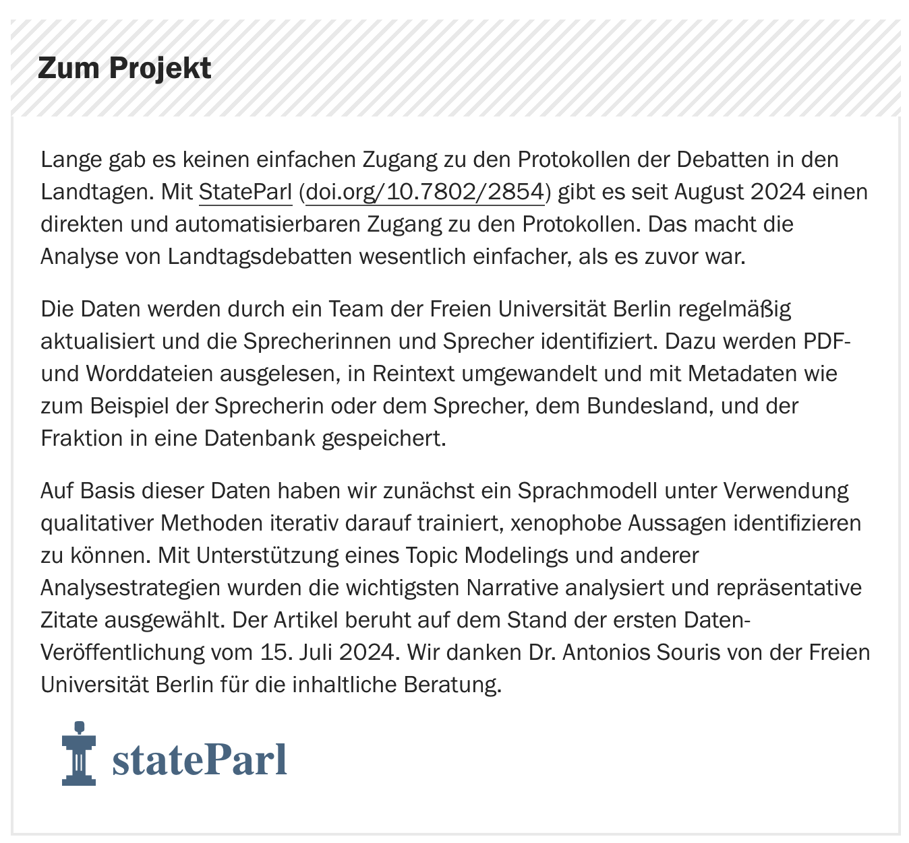
</div>

`Source` [Tagesspiegel](https://interaktiv.tagesspiegel.de/lab/von-messermaennern-und-ficki-ficki-bereicherern-so-trug-die-afd-den-hass-in-die-parlamente/).


<div align="center">
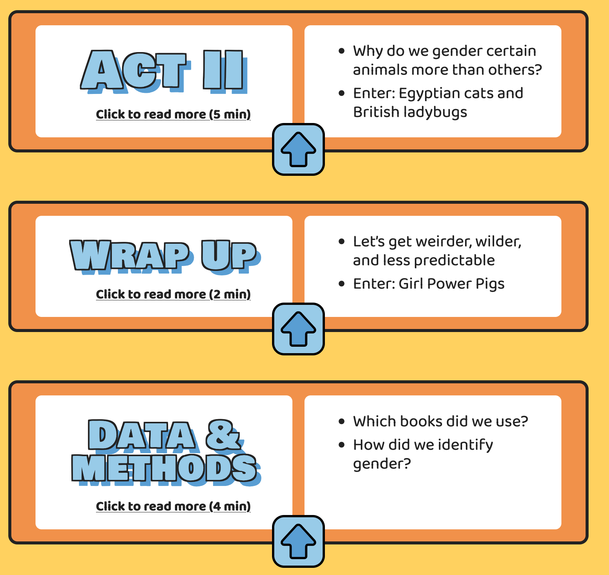
</div>

`Source` [The Pudding](https://pudding.cool/2025/07/kids-books/).
]


---
# 10. Write with purpose — paragraph by paragraph

.pull-left[

<h2 style="display:flow-root;">Every paragraph should do one job. Know what it is.</h2>

Before you keep a paragraph, ask:

- **What is this paragraph arguing?**
- **Does the first sentence signal the point?**
- **Would the piece suffer if I cut it?**

A trick from research writing: read your draft **back to front**, paragraph by paragraph. If the logic still holds in reverse, your structure is sound. If it collapses, the piece is leaning on sequence, not argument.

Another trick: Just read the **first sentence of every paragraph**. Can you still understand the story? (Caveat: Sometimes you want to surprise the reader, or build suspense, or save the punchline for the end. Use your judgement.)
]

.pull-right-center[
<div align="center">
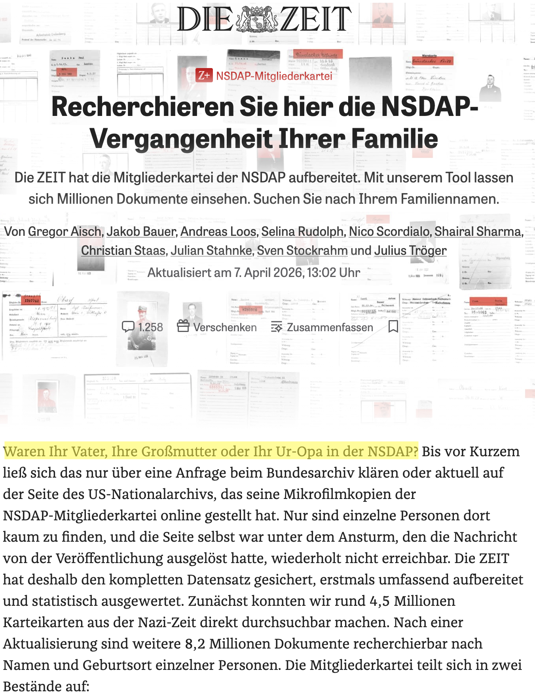
</div>

`Source` [DIE ZEIT](https://www.zeit.de/wissen/2026-04/nsdap-mitgliederkartei-karteikarten-familienmitglieder-suche).
]

